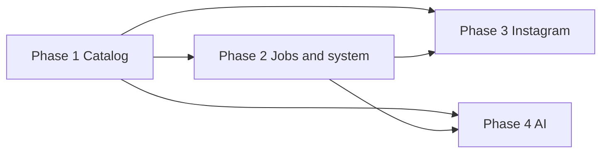

# Roadmap: Lightroom Tagger & Analyzer (v1)

**Created:** 2026-04-10  
**Source:** [.planning/REQUIREMENTS.md](./REQUIREMENTS.md) v1 requirement groups + dependency order from [.planning/research/SUMMARY.md](./research/SUMMARY.md)

## Principles

- Phases are derived from the four v1 requirement sections (no extra buckets).
- Each v1 requirement maps to **exactly one** phase (see traceability in REQUIREMENTS.md).
- Execution order: stable catalog inventory first, then cross-cutting jobs and write-safety, then Instagram match/writeback, then AI on top of jobs and photos.

## Phase overview

| Phase | Name | v1 requirements |
|-------|------|-------------------|
| 1 | Catalog management | CAT-01 … CAT-05 |
| 2 | Jobs & system reliability | SYS-01 … SYS-05 |
| 3 | Instagram sync | IG-01 … IG-06 |
| 4 | AI analysis | AI-01 … AI-06 |

**Coverage:** 22 / 22 v1 requirements mapped.

---

## Phase 1 — Catalog management

**Requirements:** CAT-01, CAT-02, CAT-03, CAT-04, CAT-05

**Intent:** Register `.lrcat` files, browse and search photos safely with stable identity across sessions.

### Success criteria (observable)

1. User registers a Lightroom catalog path and sees it available as an active context for browsing.
2. User paginates through catalog photos and sees results without the app freezing or dropping rows arbitrarily.
3. User applies search or basic filters and the visible set updates to match the criteria.
4. After signing out, refreshing, or returning another day, opening the same catalog photo still refers to the same underlying asset (stable identity).
5. Routine browsing does not corrupt the catalog file; read paths are clearly separated from write paths in behavior and documentation.

---

## Phase 2 — Jobs & system reliability

**Requirements:** SYS-01, SYS-02, SYS-03, SYS-04, SYS-05

**Intent:** Observable job lifecycle, cancellation, backup-before-write discipline, actionable errors, and Lightroom-open guardrails before Instagram writeback and AI batch work.

### Success criteria (observable)

1. User starts or inherits a long-running operation and sees status as queued, running, complete, or failed without guessing.
2. User cancels an in-progress job and the UI reflects termination (cancelled or stopped) within a reasonable time.
3. Before any catalog write, the user is informed that a backup was created (or sees evidence in a predictable location / log pattern).
4. When an operation fails, the user sees a clear, specific error message suitable for retry or support (not a silent failure).
5. When Lightroom has the catalog open, the user is prevented from or clearly warned about writes that could corrupt data.

### Plan progress (execution)

| Plan | Title | Status |
|------|--------|--------|
| 02-01 | Cooperative job cancellation and shared JobRunner wiring | **Done** (2026-04-10) |
| 02-02 | Catalog backup rotation and Lightroom lock guard before writes | **Done** (2026-04-10) |
| 02-03 | Job failure severity in API and UI badges | **Done** (2026-04-10) |
| 02-04 | Job status UX alignment, orphan recovery copy, and handler cancel checks | **Done** (2026-04-10) |

---

## Phase 3 — Instagram sync

**Requirements:** IG-01, IG-02, IG-03, IG-04, IG-05, IG-06

**Intent:** Ingest export dumps, match to catalog with confidence, human confirmation, keyword writeback, and posted visibility in the app.

### Success criteria (observable)

1. User uploads an Instagram export dump and the system completes ingest (or reports parse errors visibly).
2. User sees dump-derived posts or media listed in the app after successful parse.
3. User sees proposed catalog matches with confidence scores for dump images.
4. User confirms or rejects individual proposed matches and those decisions persist in the UI.
5. After confirmation, the user finds the `posted` keyword (or agreed token) on matched photos in Lightroom, sees posted state in the app, and can tell posted vs not-yet-posted at a glance.

### Plan progress (execution)

| Plan | Title | Status |
|------|--------|--------|
| 03-01 | Matches API dump-media thumbnails and vision_match single-image result score | **Done** (2026-04-10) |
| 03-02 | Lightroom keyword from config.instagram_keyword (auto-tag unchanged) | Pending |
| 03-03 | Instagram dump path in config + instagram_import job handler | Pending |
| 03-04 | Frontend: configure dump path and Run Import job | Pending |
| 03-05 | Ship Matches tab with MatchDetailModal and useMatchGroups | Pending |
| 03-06 | Posted visibility end-to-end and catalog API regression | Pending |

---

## Phase 4 — AI analysis

**Requirements:** AI-01, AI-02, AI-03, AI-04, AI-05, AI-06

**Intent:** Configurable providers, on-demand single and batch descriptions, durable storage, in-context viewing, and coverage indicators.

### Success criteria (observable)

1. User configures at least one AI provider (e.g. Ollama or OpenAI-class) and the app uses that configuration for subsequent jobs.
2. User triggers description for a single photo and receives a stored result tied to that photo when the job completes.
3. User triggers batch description for a selection or timeframe and sees multiple jobs or progress consistent with Phase 2 job UX.
4. User returns later, sees descriptions still attached to the same photos, and reads them in context alongside the image.
5. User can distinguish analyzed vs not-yet-analyzed photos from the UI (badge, filter, or list).

---

## Dependencies (high level)

- Phase 3 needs Phase 1 (catalog rows to match) and Phase 2 (backup, LR guard, jobs/errors for ingest and writeback).
- Phase 4 needs Phase 1 (photos to analyze) and Phase 2 (job status, cancel, errors for AI jobs).

---

## Out of scope (v1)

Deferred items remain as documented in [REQUIREMENTS.md](./REQUIREMENTS.md) (v2 and Out of Scope tables).

---
*Roadmap created: 2026-04-10 · Last plan progress edit: 2026-04-10 (plan 03-01 complete; Phase 3 execution table added).*
