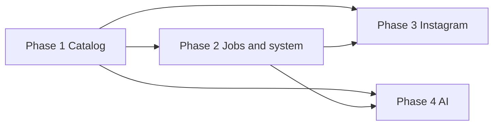
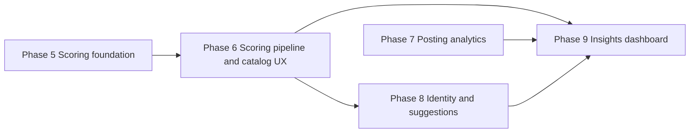
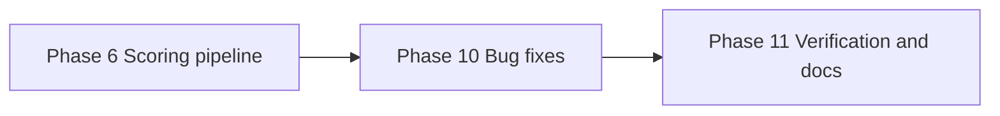

# Roadmap: Lightroom Tagger & Analyzer

**v1 created:** 2026-04-10  
**v2 milestone:** 2026-04-12 — Advanced Critique & Insights (Phases 5–9)  
**Sources:** [.planning/REQUIREMENTS.md](./REQUIREMENTS.md), [.planning/research/SUMMARY.md](./research/SUMMARY.md), [.planning/PROJECT.md](./PROJECT.md)

## Principles

- v1 Phases 1–4 shipped the MVP; v2 continues numbering at **Phase 5**.
- Each v2 requirement maps to **exactly one** phase (see traceability in REQUIREMENTS.md).
- Phase order: **schema, prompts, and output validation first**; **scoring pipeline second** (SCORE-07 no later than SCORE-01); **catalog surfacing of scores with jobs** third; **posting analytics** fourth; **identity, suggestions, and unified dashboard** last.

## Milestone v1.0 — Phase overview (complete)

| Phase | Name | v1 requirements |
|-------|------|-------------------|
| 1 | Catalog management | CAT-01 … CAT-05 |
| 2 | Jobs & system reliability | SYS-01 … SYS-05 |
| 3 | Instagram sync | IG-01 … IG-06 |
| 4 | AI analysis | AI-01 … AI-06 |

**Coverage:** 22 / 22 v1 requirements — **Complete** (2026-04-11).

---

## Phase 1 — Catalog management

**Requirements:** CAT-01, CAT-02, CAT-03, CAT-04, CAT-05

**Intent:** Register `.lrcat` files, browse and search photos safely with stable identity across sessions.

### Success criteria (observable)

1. User registers a Lightroom catalog path and sees it available as an active context for browsing.
2. User paginates through catalog photos and sees results without the app freezing or dropping rows arbitrarily.
3. User applies search or basic filters and the visible set updates to match the criteria.
4. After signing out, refreshing, or returning another day, opening the same catalog photo still refers to the same underlying asset (stable identity).
5. Routine browsing does not corrupt the catalog file; read paths are clearly separated from write paths in behavior and documentation.

---

## Phase 2 — Jobs & system reliability

**Requirements:** SYS-01, SYS-02, SYS-03, SYS-04, SYS-05

**Intent:** Observable job lifecycle, cancellation, backup-before-write discipline, actionable errors, and Lightroom-open guardrails before Instagram writeback and AI batch work.

### Success criteria (observable)

1. User starts or inherits a long-running operation and sees status as queued, running, complete, or failed without guessing.
2. User cancels an in-progress job and the UI reflects termination (cancelled or stopped) within a reasonable time.
3. Before any catalog write, the user is informed that a backup was created (or sees evidence in a predictable location / log pattern).
4. When an operation fails, the user sees a clear, specific error message suitable for retry or support (not a silent failure).
5. When Lightroom has the catalog open, the user is prevented from or clearly warned about writes that could corrupt data.

### Plan progress (execution)

| Plan | Title | Status |
|------|--------|--------|
| 02-01 | Cooperative job cancellation and shared JobRunner wiring | **Done** (2026-04-10) |
| 02-02 | Catalog backup rotation and Lightroom lock guard before writes | **Done** (2026-04-10) |
| 02-03 | Job failure severity in API and UI badges | **Done** (2026-04-10) |
| 02-04 | Job status UX alignment, orphan recovery copy, and handler cancel checks | **Done** (2026-04-10) |

---

## Phase 3 — Instagram sync

**Requirements:** IG-01, IG-02, IG-03, IG-04, IG-05, IG-06

**Intent:** Ingest export dumps, match to catalog with confidence, human confirmation, keyword writeback, and posted visibility in the app.

### Success criteria (observable)

1. User uploads an Instagram export dump and the system completes ingest (or reports parse errors visibly).
2. User sees dump-derived posts or media listed in the app after successful parse.
3. User sees proposed catalog matches with confidence scores for dump images.
4. User confirms or rejects individual proposed matches and those decisions persist in the UI.
5. After confirmation, the user finds the `posted` keyword (or agreed token) on matched photos in Lightroom, sees posted state in the app, and can tell posted vs not-yet-posted at a glance.

### Plan progress (execution)

| Plan | Title | Status |
|------|--------|--------|
| 03-01 | Matches API dump-media thumbnails and vision_match single-image result score | **Done** (2026-04-10) |
| 03-02 | Lightroom keyword from config.instagram_keyword (auto-tag unchanged) | **Done** (2026-04-10) |
| 03-03 | Instagram dump path in config + instagram_import job handler | **Done** (2026-04-10) |
| 03-04 | Frontend: configure dump path and Run Import job | **Done** (2026-04-10) |
| 03-05 | Ship Matches tab with MatchDetailModal and useMatchGroups | **Done** (2026-04-10) |
| 03-06 | Posted visibility end-to-end and catalog API regression | **Done** (2026-04-10) |

---

## Phase 4 — AI analysis

**Requirements:** AI-01, AI-02, AI-03, AI-04, AI-05, AI-06

**Intent:** Configurable providers, on-demand single and batch descriptions, durable storage, in-context viewing, and coverage indicators.

### Success criteria (observable)

1. User configures at least one AI provider (e.g. Ollama or OpenAI-class) and the app uses that configuration for subsequent jobs.
2. User triggers description for a single photo and receives a stored result tied to that photo when the job completes.
3. User triggers batch description for a selection or timeframe and sees multiple jobs or progress consistent with Phase 2 job UX.
4. User returns later, sees descriptions still attached to the same photos, and reads them in context alongside the image.
5. User can distinguish analyzed vs not-yet-analyzed photos from the UI (badge, filter, or list).

### Plan progress (execution)

| Plan | Title | Status |
|------|--------|--------|
| 04-01 | Catalog analyzed filter and embedded description fields in API | **Done** (2026-04-11) |
| 04-02 | Catalog grid AI badges, score pill, and analyzed filter UI | **Done** (2026-04-11) |
| 04-03 | Catalog modal description panel and on-demand generate | **Done** (2026-04-11) |
| 04-04 | Batch describe: 12-month window, min_rating metadata, and SQL alignment | **Done** (2026-04-11) |
| 04-05 | Provider health probe, connection badges, and description defaults UX | **Done** (2026-04-11) |
| 04-06 | Vision pipeline safety nets: SR2 support, size validation, and pre-flight filtering | **Done** (2026-04-11) |

---

## Milestone v2.0 — Phase overview (Phases 5–9)

| Phase | Name | v2 requirements |
|-------|------|-----------------|
| 5 | Structured scoring foundation | SCORE-02, SCORE-05, SCORE-06, SCORE-07, JOB-01, JOB-02 |
| 6 | Scoring pipeline & catalog score UX | SCORE-01, SCORE-03, SCORE-04 |
| 7 | Posting analytics | POST-01, POST-02, POST-03, POST-04 |
| 8 | Identity & “what to post next” | IDENT-01, IDENT-02, IDENT-03 |
| 9 | Insights dashboard | DASH-01 |

**Coverage:** 17 / 17 v2 requirements mapped.

**Dependency note:** Phase 6 depends on Phase 5 (validated contracts and persistence). Phases 8–9 depend on scored data from Phases 5–6 and benefit from posting analytics from Phase 7. Phase 7 is ingest- and match-driven and can proceed in parallel with Phase 6 once dump data exists from v1.

---

## Phase 5 — Structured scoring foundation

**Requirements:** SCORE-02, SCORE-05, SCORE-06, SCORE-07, JOB-01, JOB-02

**Intent:** Additive library DB shape for queryable per-perspective scores; photography-theory-grounded rubrics and configurable perspectives; **SCORE-07 foundation:** Pydantic score validation, deterministic repair, **LLM JSON-repair hook** (`make_score_json_llm_fixer` + `parse_score_response_with_retry`), golden tests — so Phase 6 scoring handlers only need to wire the live fixer at call time (see 05-03 must_haves). Describe pipeline `parse_description_response` stays legacy until a later phase refactors it. **Job checkpointing and auto-recovery** so long-running jobs survive backend restarts. JOB-01/JOB-02 ensure scoring batch jobs (and existing describe jobs) don't lose progress on restart.

### Success criteria (observable)

1. User (or operator) can run migrations on a catalog library DB without breaking existing description rows; new score-related columns or tables exist and are documented for nullable / legacy semantics.
2. User-facing copy or settings reflect at least one **new** critique perspective beyond the original three (e.g. color theory, emotional impact, or series coherence), selectable where perspectives are chosen for analysis.
3. Critique prompts used for scoring reference photography theory framing (documented rubric sources or prompt library location), not only generic free-form instructions.
4. For **score-shaped** structured output, malformed LLM output is handled per D-12: deterministic repair, then optional LLM JSON repair, then explicit failure — not silent corruption or empty score rows (full describe blob validation is Phase 6+ unless separately scoped).
5. Automated tests or golden fixtures demonstrate validation/repair/**llm_fixer** behavior for representative malformed JSON (aligned with SCORE-07 / plan 05-03).
6. When backend restarts mid-job, the job resumes from last checkpoint on startup — not from scratch. Progress already committed (e.g. 500/2000 images described) is preserved.
7. Orphaned jobs (marked "running" but process dead) are detected on startup and either auto-resumed or marked for retry with clear status.

### Plan progress (execution)

| Plan | Title | Status |
|------|--------|--------|
| 05-01 | Library DB migration: queryable score storage, indexes, nullable legacy semantics | Not started |
| 05-02 | Rubric prompt library: theory-grounded templates + configurable perspective registry | Not started |
| 05-03 | Structured output schema (e.g. Pydantic), repair/retry path, and unit tests | Not started |
| 05-04 | API/schema documentation for score fields and perspective keys | Not started |
| 05-05 | Job checkpointing: periodic progress commit + resume-from-checkpoint on restart | Not started |
| 05-06 | Orphan job recovery: startup detection of dead jobs + auto-resume or retry marking | Not started |

---

## Phase 6 — Scoring pipeline & catalog score UX

**Requirements:** SCORE-01, SCORE-03, SCORE-04

**Intent:** Jobs and write path that produce numeric scores (1–10) per perspective with rationale; persist model and prompt/rubric version with each result; support re-run with a new rubric while retaining history; **catalog list and/or modal expose filters and sorting by persisted scores** (consumes SCORE-02 from Phase 5).

### Success criteria (observable)

1. User triggers scoring (single image or batch) and, on success, sees numeric scores per perspective with short written rationale in the catalog or image detail context.
2. User inspects a scored image and can tell **which model and rubric/prompt version** produced the visible scores (badge, metadata panel, or equivalent).
3. User re-runs scoring after a rubric update and can still access or compare **prior** scored generations distinct from the latest (version selector, history list, or dual timestamps).
4. User applies a **score-based filter or sort** in the catalog grid (e.g. by perspective or axis) and the result set changes accordingly.
5. Failed scoring jobs surface through existing job UX with enough detail to retry or change provider settings.

### Plan progress (execution)

| Plan | Title | Status |
|------|--------|--------|
| 06-01 | Scoring job handler(s), idempotency keys, integration with vision/provider stack | Not started |
| 06-02 | Persist scores + rationale + `prompt_version` / model metadata via single write funnel | Not started |
| 06-03 | Version history / supersede semantics in API and image detail UI | Not started |
| 06-04 | Catalog API query params + UI controls for filter/sort by persisted scores | Not started |

---

## Phase 7 — Posting analytics

**Requirements:** POST-01, POST-02, POST-03, POST-04

**Intent:** Charts and views from Instagram **dump** timestamps and captions only (no engagement API); highlight cadence, timing patterns, caption/hashtag style, and **catalog vs posted** gaps.

### Success criteria (observable)

1. User opens a posting-analytics view and sees **posting frequency over time** as a timeline or histogram derived from matched dump timestamps.
2. User sees **time-of-day and day-of-week** patterns (e.g. heatmap or equivalent) for when posts occurred.
3. User sees **caption and hashtag** aggregates or summaries across posted images (frequencies, top tokens, or style summary — within v2 “simple analysis” scope).
4. User opens a **not-yet-posted** or **gap** view listing catalog images that lack a confirmed post match, and can navigate from an item to the catalog.
5. Chart labels or footers clarify timezone / export assumptions so users do not misread raw UTC as local wall time without notice.

### Plan progress (execution)

| Plan | Title | Status |
|------|--------|--------|
| 07-01 | Insights service + API: posting frequency buckets (UTC-normalized ingest) | Not started |
| 07-02 | Time-of-day / day-of-week aggregation endpoints + chart payloads | Not started |
| 07-03 | Caption & hashtag rollup queries + API | Not started |
| 07-04 | Posted-gap catalog query + UI entry point | Not started |

---

## Phase 8 — Identity & “what to post next”

**Requirements:** IDENT-01, IDENT-02, IDENT-03

**Intent:** Rank “best photos” from aggregated perspective scores; surface a **style fingerprint** from patterns in scores/themes; suggest **what to post next** using catalog scores vs posting history gaps, with explainable hints (not a black box).

### Success criteria (observable)

1. User opens a “best photos” or ranked view and sees catalog images ordered by an **aggregated score** derived from existing perspective scores, with explicit labeling of which perspectives/versions contributed.
2. User views a **style fingerprint** summary (themes, recurring strengths, or pattern labels) tied to **evidence** — e.g. linked example images or score breakdowns — not empty adjectives.
3. User requests or sees **“what to post next”** suggestions that name **why** each candidate is suggested (gap vs history, under-represented theme, high score not yet posted, etc.).
4. Empty or low-coverage states explain that more scoring or matching is needed instead of showing misleading rankings.
5. All views respect **catalog scope** (single registered catalog) and do not leak other catalogs’ data.

### Plan progress (execution)

| Plan | Title | Status |
|------|--------|--------|
| 08-01 | Aggregation job or query layer for ranked “best photos” with coverage guards | Not started |
| 08-02 | Style fingerprint synthesis (pattern rollup + UI presentation with examples) | Not started |
| 08-03 | Suggestion heuristic: catalog scores × posting gaps + explainability copy | Not started |

---

## Phase 9 — Insights dashboard

**Requirements:** DASH-01

**Intent:** Single **insights** destination combining score distributions, posting patterns, and top-scored photos — reusing Phase 7–8 building blocks with cohesive layout and shared filters.

### Success criteria (observable)

1. User navigates to a dedicated **insights** page (or clearly named dashboard route) without hunting through disconnected tabs.
2. The page shows **score distribution** (histogram, bucket chart, or equivalent) for at least one perspective or aggregate, with model/prompt version context where relevant.
3. The page includes **posting pattern** visualizations consistent with Phase 7 (frequency and/or timing), or deep-links to them with shared date scope.
4. The page surfaces **top-scored** or featured photos consistent with IDENT-01 logic, with click-through to the catalog image.
5. Loading, error, and **empty states** are explicit (e.g. no dump imported, insufficient scored images).

### Plan progress (execution)

| Plan | Title | Status |
|------|--------|--------|
| 09-01 | Insights dashboard route + layout shell (charts placeholders wired to APIs) | Not started |
| 09-02 | Integrate score distribution + posting widgets with shared scope controls | Not started |
| 09-03 | Top-scored strip or grid + navigation to catalog modal | Not started |

---

## Dependencies (high level)

### v1

### v2 (Phases 5–9)

- Phase 6 requires Phase 5 (schema, prompts, validation).
- Phases 8–9 require Phase 6 (scored data). Phase 9 also composes Phase 7 (posting) and Phase 8 (ranking/fingerprint/suggestions) into one page.
- Phase 7 can run in parallel with Phase 6 after v1 Instagram data exists; Phase 8 should follow Phase 6; Phase 9 follows 7 and 8.

---

## Phase 10 — Batch scoring fix and integration bug fixes

**Requirements:** SCORE-01, SCORE-04, IDENT-01, IDENT-02, IDENT-03
**Gap Closure:** Closes critical integration gaps from v2.0 audit (2026-04-14)
**Depends on:** Phase 6

**Intent:** Fix `batch_score` non-force image selection (queries undescribed instead of unscored), wire `offset` through identity suggestions endpoint, and disambiguate identity aggregation keys by `(image_key, image_type)`.

### Success criteria (observable)

1. User runs batch scoring with Force off after bulk describe and the job queues **all unscored** images (not zero).
2. `/api/identity/suggestions` with `offset` returns a shifted result set consistent with `limit`.
3. Identity rankings aggregate catalog-only scores (excluding Instagram rows) so catalog and Instagram keys cannot collide.

### Plan progress (execution)

| Plan | Title | Status |
|------|--------|--------|
| 10-01 | Fix batch_score image selection to target unscored images | Not started |
| 10-02 | Wire offset through suggestions endpoint and disambiguate identity keys | Not started |

---

## Phase 11 — Phase 6–9 verification and documentation update

**Requirements:** SCORE-01, SCORE-03, SCORE-04, POST-01, POST-02, POST-03, POST-04, IDENT-01, IDENT-02, IDENT-03, DASH-01
**Gap Closure:** Creates missing VERIFICATION.md for Phases 6–9, updates ROADMAP.md progress tables and REQUIREMENTS.md checkboxes
**Depends on:** Phase 10

**Intent:** Formally verify all delivered code in Phases 6–9 against plan must-haves and success criteria; update stale documentation to reflect actual project state.

### Success criteria (observable)

1. Each of Phases 6, 7, 8, 9 has a VERIFICATION.md with status, requirement-by-requirement evidence, and automated check results.
2. ROADMAP.md plan progress tables for Phases 5–9 reflect **Done** status with dates.
3. REQUIREMENTS.md checkboxes and traceability status reflect verified completion for all 17 v2 requirements.

### Plan progress (execution)

| Plan | Title | Status |
|------|--------|--------|
| 11-01 | Create VERIFICATION.md for Phases 6–9 with automated checks | Not started |
| 11-02 | Update ROADMAP.md progress tables and REQUIREMENTS.md checkboxes | Not started |

---

## Dependencies (high level) — gap closure

- Phase 10 fixes code bugs before Phase 11 can verify correctness.

---

## Out of scope

Deferred and out-of-scope items remain as documented in [REQUIREMENTS.md](./REQUIREMENTS.md).

---
*Roadmap v1 section: 2026-04-10 · v1 complete: 2026-04-11 · v2 Phases 5–9 added: 2026-04-12 · Gap closure Phases 10–11 added: 2026-04-14.*
