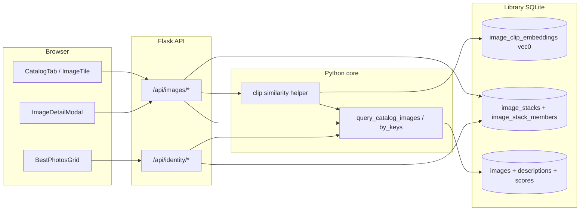

# Phase 6: Similarity & Stack UI - Research

**Researched:** 2026-04-25  
**Domain:** sqlite-vec CLIP KNN on catalog, Flask image/identity APIs, React catalog/identity grids (`ImageTile`)  
**Confidence:** HIGH (existing code + sqlite-vec docs); MEDIUM (stack list-collapse semantics — product/API shape)

## Summary

Phase 6 adds two capabilities on top of shipped Phase 4 (burst stacks in `image_stacks` / `image_stack_members`) and Phase 5 (`image_clip_embeddings` vec0, 512-d cosine, `clip-ViT-B-32` via `sentence-transformers`). **SIM-02** needs a seed-image visual similarity path that queries **only** the CLIP table—never `image_text_embeddings` (768-d)—matching locked decision D-05. The backend should follow the same sqlite-vec KNN SQL shape already proven in `knn_embedded_catalog_keys` for text vectors [VERIFIED: `lightroom_tagger/core/semantic_search.py`], swapping the virtual table to `image_clip_embeddings`. Optional catalog pre-filters (posted, month, etc.) are not vec0 metadata columns today [VERIFIED: `database.py` vec0 DDL]; the practical pattern is **over-fetch KNN** then **order-preserving filter** (same spirit as hybrid semantic post-filter in `run_semantic_hybrid_search`) [VERIFIED: `semantic_search.py`]. **STACK-03** requires stack representative + member-count badge + expand/collapse using `ImageTile` overlay/footer slots [VERIFIED: `ImageTile.tsx`]. Catalog rows come from `query_catalog_images`; best photos from `rank_best_photos` / `IdentityAPI.getBestPhotos`. Today both surfaces can show **non-representative** stack members as their own rows if they have scores/list presence; the requirement text favors **one visible tile per stack (representative)**—that implies a **collapse/dedup** step in API or UI that the planner must specify (see Open Questions).

**Primary recommendation:** Add a dedicated `GET` (or `POST` if query params are too large) similar-images route in `api/images.py`, implemented with a small `lightroom_tagger/core/` helper (e.g. `clip_similarity.py`) that loads the seed blob from `image_clip_embeddings`, runs vec KNN, excludes the seed key, applies optional filters while preserving distance order, then reuses `query_catalog_images_by_keys` + `_rows_to_catalog_api_images` for response shape. Extend catalog and best-photos payloads with generic stack fields (`stack_id`, `stack_member_count`, `is_stack_representative`) per D-04, plus one focused members endpoint or lazy fetch to avoid N+1.

<user_constraints>
## User Constraints (from CONTEXT.md)

### Locked Decisions

**Phase 7 Handoff**

- **D-01:** Build the visible Phase 6 features first: stack display/expansion and catalog-photo visual similarity.
- **D-02:** Include small reusable plumbing only when it naturally falls out of Phase 6 work. Examples: shared similar-image API response types, frontend helper functions used by Catalog now and reusable by SearchPage later, and generic stack metadata fields that future matching can consume.
- **D-03:** Do not add speculative Phase 7 behavior in Phase 6. No chat pin UI, no split/merge/change-representative controls, and no Instagram matching behavior.
- **D-04:** Future handoff should stay generic. Prefer data shapes like `stack_id`, `stack_member_count`, `is_stack_representative`, and similar-image result metadata over matching-specific or chat-specific branches unless they are already needed by the visible Phase 6 UI.

**Carry-Forward Decisions**

- **D-05:** Visual similarity must use the Phase 5 CLIP image embedding space (`image_clip_embeddings`, 512 dim, `clip-ViT-B-32`) and must not mix with Phase 3 text embeddings (`image_text_embeddings`, 768 dim).
- **D-06:** Stack UI builds on Phase 4 burst stacks only. pHash near-duplicate clustering was dropped and should not re-enter Phase 6 scope.
- **D-07:** Stack representatives come from Phase 4's representative selection contract; Phase 6 displays and navigates existing stack data rather than redefining how representatives are chosen.

### Claude's Discretion

- Exact placement of the visible "More like this" control on catalog cards/detail surfaces.
- Exact member expansion UI for stack browsing, as long as Catalog and Best Photos stay consistent with existing `ImageTile` and grid/card patterns.
- Whether the reusable frontend similarity helper is a hook, service method, or local callback, as long as it is used by Phase 6 and simple for Phase 7 to reuse.

### Deferred Ideas (OUT OF SCOPE)

- Chat pin-to-image UI and behavior — Phase 7 (NLS-06).
- Stack-aware Instagram matching — Phase 7 (STACK-04).
- Split, merge, and change representative controls — Phase 7 (STACK-05).
- pHash near-duplicate stack clustering — dropped from Phase 4 and not reintroduced here.
</user_constraints>

<phase_requirements>
## Phase Requirements

| ID | Description | Research Support |
|----|-------------|------------------|
| **SIM-02** | "More like this" from any catalog photo; catalog view now; NLS-05 chat panel in requirement text is **NLS-06 (Phase 7)** per CONTEXT D-03 | CLIP vec0 + KNN helper + new images API route; reuse catalog image DTOs; exclude seed from results; degrade when embedding missing |
| **STACK-03** | Catalog + Best Photos show stack representative with count badge; expand/collapse to browse members without breaking list performance | Join `image_stacks` / `image_stack_members` for metadata; badge via `ImageTile` `overlayBadges`; lazy member fetch; optional list **collapse** so only reps appear as primary rows (see Open Questions) |
</phase_requirements>

## Project Constraints (from .cursor/rules/)

From `.cursor/rules/AGENTS.md` (and `frontend-design.md`):

- **Stack:** Python 3.10+ package + Flask visualizer + React 19 / Vite / Tailwind; API JSON helpers in `utils/responses.py`; parameterized DB access—no raw user SQL.
- **Frontend:** Follow `apps/visualizer/frontend/DESIGN.md` (semantic tokens, light/dark, single accent); prefer `constants/strings.ts` for copy; extend `Badge` / `Card` patterns rather than new primitives without need.
- **GSD:** Prefer routing work through GSD workflow for implementation phases (research artifact is exempt).

## Architectural Responsibility Map

| Capability | Primary Tier | Secondary Tier | Rationale |
|------------|-------------|----------------|-----------|
| CLIP KNN query | API / Backend | Library DB (sqlite-vec) | Flask route + core DB read; vectors live in library SQLite |
| Seed vector lookup | Database | — | `SELECT` from `image_clip_embeddings` by `image_key` |
| Optional pre-filters on similarity results | API / Backend | — | Intersect KNN-ordered keys with catalog constraints (metadata not in vec0) |
| Similarity response shape | API / Backend | — | Reuse `_rows_to_catalog_api_images` + `thumbnail_url` pattern |
| Stack metadata on list rows | API / Backend | — | JOIN or batched lookup; avoid per-tile member queries |
| Stack member expansion | Browser / Client | API | Lazy fetch members when user expands; keep grids virtualized/paginated |
| "More like this" control | Browser / Client | API | CatalogTab / detail modal; types/helpers reusable by SearchPage in Phase 7 |

## Standard Stack

### Core

| Library | Version | Purpose | Why Standard |
|---------|---------|---------|--------------|
| sqlite-vec | 0.1.9 [VERIFIED: `pyproject.toml`] | vec0 KNN (`MATCH` + `k = ?`) | Already used for text + CLIP tables; project standard per REQUIREMENTS guidance |
| sentence-transformers | >=3.0.0 [VERIFIED: `pyproject.toml`] | CLIP model `clip-ViT-B-32` [VERIFIED: `clip_embedding_service.py`] | Phase 5 embedding job already depends on it; no second embedding stack |
| Flask + existing blueprints | [VERIFIED: `api/images.py`, `api/identity.py`] | HTTP API | New routes belong next to existing catalog/search endpoints |

### Supporting

| Library | Pattern | Purpose | When to Use |
|---------|---------|---------|-------------|
| `query_catalog_images_by_keys` | [VERIFIED: `database.py`] | Hydrate KNN key lists into full catalog rows | After ordered key list from similarity |
| `_rows_to_catalog_api_images` | [VERIFIED: `api/images.py`] | Normalize DB rows for frontend | Identical thumbnails/scores shape as catalog |

### Alternatives Considered

| Instead of | Could Use | Tradeoff |
|------------|-----------|----------|
| sqlite-vec KNN | Brute-force numpy over all embeddings | Violates scale + "Don't hand-roll"; sqlite-vec already loaded |
| Merging CLIP + text vectors | Single query | **Forbidden** by D-05; different dims and semantics |

**Installation:** Already in repo; no new packages required for minimal Phase 6.

**Version verification:** `sqlite-vec==0.1.9` and `sentence-transformers>=3.0.0` pinned/ranged in `pyproject.toml` [VERIFIED: `pyproject.toml`]; npm registry `sqlite-vec` is unrelated (JS port)—Python dep is authoritative.

## Architecture Patterns

### System Architecture Diagram



### Recommended layout (no new top-level apps)

- **Core:** `lightroom_tagger/core/` — `clip_similarity.py` (or equivalent): `knn_clip_catalog_keys(conn, query_blob, k)`, `run_similar_catalog_images(conn, seed_key, filters, limit, offset)`; keep SQL out of Flask handlers where possible.
- **API:** `apps/visualizer/backend/api/images.py` — new route e.g. `GET /api/images/catalog/<key>/similar` (exact path planner chooses); stack members e.g. `GET /api/images/stacks/<id>/members`.
- **Frontend:** `services/api.ts` — `ImagesAPI.getSimilarCatalog` + stack types; `CatalogTab.tsx`, `BestPhotosGrid.tsx`, optional small hook `useSimilarImages` / `useStackMembers`.

### Pattern 1: sqlite-vec KNN (CLIP)

**What:** Bind query vector as float32 blob; `WHERE embedding MATCH ? AND k = ?` on `image_clip_embeddings`.  
**When to use:** Every SIM-02 query.  
**Example:**

```python
# Source: VERIFIED — parallel to lightroom_tagger/core/semantic_search.py::knn_embedded_catalog_keys
rows = conn.execute(
    """
    SELECT image_key, distance
    FROM image_clip_embeddings
    WHERE embedding MATCH ?
      AND k = ?
    """,
    (query_vec_blob, k),
).fetchall()
```

[CITED: https://raw.githubusercontent.com/asg017/sqlite-vec/main/site/features/vec0.md — vec0 KNN + metadata constraints]

### Pattern 2: Order-preserving filter after KNN

**What:** Fetch top `KNN_K` neighbors, drop seed, optionally drop keys failing catalog filters by scanning in rank order until `limit` satisfied (or single SQL `IN` + sort in Python by first occurrence).  
**When to use:** Optional pre-filters (posted, month, rating, etc.) that cannot be expressed as vec0 metadata [VERIFIED: current vec0 DDL only has `embedding`, `image_key`].  
**Anti-pattern:** Reusing `run_semantic_hybrid_search` or text embedding helpers for CLIP—violates D-05.

### Pattern 3: Stack badge + lazy members

**What:** List endpoints return `stack_id`, `stack_member_count`, `is_stack_representative`; expansion calls a members endpoint once.  
**When to use:** STACK-03; avoids loading all members for every grid row.

### Anti-Patterns to Avoid

- **Wrong embedding table:** Using `image_text_embeddings` or `embed_query_to_vec_blob` (text) for image similarity—dims and model differ [VERIFIED: Phase 3 vs 5 schemas in `database.py`].
- **N+1 stack fetches:** Per-tile member queries on paginated grids.
- **Chat pin UI:** Explicitly out of scope [CONTEXT D-03].

## Don't Hand-Roll

| Problem | Don't Build | Use Instead | Why |
|---------|-------------|-------------|-----|
| Vector KNN at scale | Linear scan in Python over all embeddings | sqlite-vec `MATCH` | Extension + vec0 already integrated |
| Combined text+image embedding space | Custom fusion for SIM-02 | CLIP-only query on `image_clip_embeddings` | D-05; incompatible dims |
| New thumbnail server | Alternate image URLs | Existing `/api/images/catalog/<key>/thumbnail` | One cache + auth path |

**Key insight:** The project already paid the integration cost for sqlite-vec; SIM-02 is a thin parallel to text KNN with a different table and seed-vector source.

## Common Pitfalls

### Pitfall 1: Seed image included in "similar" results

**What goes wrong:** KNN returns the query image as distance 0.  
**How to avoid:** Filter `image_key != seed_key` before hydrating rows.  
**Warning signs:** Duplicate tile in grid.

### Pitfall 2: Missing CLIP row

**What goes wrong:** Job not run or failed for an image; similarity 404 or empty.  
**How to avoid:** Clear API error or empty state metadata (`similarity_unavailable_reason`) consistent with semantic search meta pattern.  
**Warning signs:** User clicks "More like this" on old imports with no embedding.

### Pitfall 3: Breaking pagination totals when collapsing stacks

**What goes wrong:** If catalog SQL dedupes members to representatives, `COUNT(*)` and page boundaries change vs current behavior.  
**How to avoid:** Document new semantics; add tests; consider `total_stacks` vs `total_images` if both matter.  
**Warning signs:** Off-by-one pagination after stack ship.

### Pitfall 4: sqlite-vec metadata misuse

**What goes wrong:** Adding `LIKE` / `json_each` filters inside vec0 `WHERE` for KNN.  
**How to avoid:** Per official docs, only simple comparisons on metadata columns work in KNN `WHERE`; complex filters belong in post-processing [CITED: sqlite-vec vec0.md]. Current schema has no filter metadata—post-filter in code.

## Code Examples

### Fetch seed blob for KNN

```python
# Source: VERIFIED pattern — lightroom_tagger/core/database.py upsert uses same table
row = conn.execute(
    "SELECT embedding FROM image_clip_embeddings WHERE image_key = ?",
    (seed_key,),
).fetchone()
if not row:
    # return 404 or structured empty
    ...
query_vec_blob = row["embedding"]
```

### Cosine distance → display similarity

```python
# Source: VERIFIED — lightroom_tagger/core/semantic_search.py::_why_matched_for_key
similarity = max(0.0, min(1.0, 1.0 - float(distance)))
```

## State of the Art

| Old Approach | Current Approach | When Changed | Impact |
|--------------|------------------|--------------|--------|
| Text embeddings only for search | Separate vec0 tables per modality (768 text vs 512 CLIP) | Phase 5 migration [VERIFIED: `user_version` 5 in `database.py`] | SIM-02 must target CLIP table only |
| pHash stacks | Burst stacks only | Phase 4 descope [CONTEXT D-06] | UI ignores pHash stacks |

**Deprecated/outdated:**

- **STACK-02 pHash clustering in Phase 4** — dropped; do not plan pHash-driven stack UI [CONTEXT].

## Assumptions Log

| # | Claim | Section | Risk if Wrong |
|---|-------|---------|---------------|
| A1 | Best Photos + Catalog should **collapse** stack members to a single representative row for primary grid display | Open Questions / STACK-03 | Wrong UX or double-counting if members must remain visible as separate rows |
| A2 | Similarity pre-filters can be implemented by post-filtering ordered KNN without a DB migration | Architecture Patterns | Rare edge: need much larger `k` to fill a page under heavy filters |

**If this table is empty of other rows:** Remaining claims were verified from repo or cited docs.

## Open Questions

1. **List collapse semantics for STACK-03**
   - **What we know:** Requirement text says representative + count + expand; `rank_best_photos` and `query_catalog_images` currently operate per `image_key`, so stack members can appear as separate tiles.
   - **What's unclear:** Should non-representative members disappear from default catalog/best-photos grids entirely, or stay visible with a "in stack" affordance?
   - **Recommendation:** Decide in PLAN.md with user-facing pagination rules; if collapsing, implement in SQL (subquery) or API post-process with explicit `total` definition.

2. **SIM-02 vs NLS-06 wording in REQUIREMENTS.md**
   - **What we know:** SIM-02 mentions chat panel; CONTEXT locks chat pin to Phase 7.
   - **What's unclear:** Whether to partially satisfy SIM-02 text in Phase 6 with **only** catalog, or add a no-UI API hook.
   - **Recommendation:** Phase 6 ships catalog UX + reusable API/types; Phase 7 wires SearchPage—document traceability in verification.

3. **Similar route shape: GET vs POST**
   - **What we know:** Many optional filters mirror `query_catalog_images` query params.
   - **What's unclear:** URL length if all filters are duplicated on similar endpoint.
   - **Recommendation:** Prefer `GET` with shared param subset; if explosion, `POST` JSON body with Pydantic validation (mirrors semantic-search).

## Environment Availability

| Dependency | Required By | Available | Version | Fallback |
|------------|------------|-----------|---------|----------|
| Python | Backend, pytest | ✓ (probe) | 3.9.6 on probe host [VERIFIED: local `python3 --version`]; project requires >=3.10 per `pyproject.toml` | Use 3.10+ venv per AGENTS.md |
| Node | Vite / Vitest | ✓ | v24.14.1 [VERIFIED: probe] | Match `apps/visualizer/frontend/.nvmrc` (24) |
| sqlite-vec extension | vec0 | ✓ | 0.1.9 | Project standard; init loads extension in `init_database` |

**Missing dependencies with no fallback:**

- None for design work; CI/local must load sqlite-vec for KNN tests.

**Missing dependencies with fallback:**

- None identified.

## Security Domain

> `workflow.nyquist_validation` is false in `.planning/config.json` — no phase test matrix section required.

### Applicable ASVS Categories

| ASVS Category | Applies | Standard Control |
|---------------|---------|------------------|
| V2 Authentication | no | — (local visualizer; existing session model unchanged) |
| V3 Session Management | no | — |
| V4 Access Control | partial | Catalog images already exposed by key; ensure similar/members routes use same DB access as existing catalog routes |
| V5 Input Validation | yes | Clamp `k`/`limit`/`offset`; validate `image_key` path segments; reject malformed filter params with 400 [pattern: `_clamp_pagination`, existing catalog] |
| V6 Cryptography | no | — |

### Known Threat Patterns

| Pattern | STRIDE | Standard Mitigation |
|---------|--------|---------------------|
| SQL injection in filters | Tampering | Reuse `query_catalog_images` parameter binding; never concatenate user FTS strings into raw SQL |
| DoS via huge `k` | Denial of service | Upper bound `k` (e.g. same order as `KNN_K` in semantic search) |

## Sources

### Primary (HIGH confidence)

- `lightroom_tagger/core/database.py` — `image_clip_embeddings` vec0 DDL, `upsert_image_clip_embedding`, `query_catalog_images`
- `lightroom_tagger/core/semantic_search.py` — `knn_embedded_catalog_keys`, hybrid post-filter pattern
- `lightroom_tagger/core/clip_embedding_service.py` — `CLIP_EMBED_MODEL_ID`, `numpy_to_clip_vec_blob`
- `apps/visualizer/backend/api/images.py` — `_rows_to_catalog_api_images`, catalog routes
- `apps/visualizer/frontend/src/components/image-view/ImageTile.tsx` — overlay/footer API
- [sqlite-vec vec0 documentation](https://raw.githubusercontent.com/asg017/sqlite-vec/main/site/features/vec0.md) — KNN `MATCH`, `k`, metadata constraints

### Secondary (MEDIUM confidence)

- `.planning/phases/06-similarity-stack-ui/06-CONTEXT.md` — scope and locked decisions
- `.planning/REQUIREMENTS.md` — SIM-02, STACK-03 definitions

## Metadata

**Confidence breakdown:**

- Standard stack: **HIGH** — pinned in repo and CONTEXT
- Architecture: **HIGH** — follows existing patterns; **MEDIUM** on stack list-collapse
- Pitfalls: **HIGH** — derived from code review of semantic + vec schema

**Research date:** 2026-04-25  
**Valid until:** ~30 days (stable stack); revisit if sqlite-vec or embedding model changes
