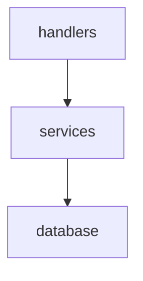

# Module boundaries and layering

This document is the authoritative boundary policy for Python packages in this repository. Ruff configuration references it from `pyproject.toml`.

## Layers

HTTP/Flask handlers and job adapters live above the library: they translate HTTP and job metadata into calls into `lightroom_tagger.core`. **Pipelines** (`lightroom_tagger/core/pipelines.py`, per [ADR-0003](adr/0003-pipeline-layer.md)) are the intended orchestration layer between handlers and services; that module is the target design even if parts of the tree still call services directly during refactors.

## File size budget

Non-test Python files under `lightroom_tagger/core/` must be **≤ 400** physical lines as reported by `wc -l` (inclusive of blanks and comments).

## What belongs in each layer

- **HTTP / Flask handlers** (`apps/visualizer/backend/jobs/`, `apps/visualizer/backend/api/`) — routing, request parsing, response shaping, progress callbacks into the job runner, and thin delegation to the library.
- **Services** (`lightroom_tagger/core/` except the `database/` package internals) — domain logic: matching, analysis, scoring, identity, NL search, embeddings, and similar.
- **Database package** (`lightroom_tagger/core/database/`) — persistence: SQL, migrations, stores, and catalog/library write paths (see [ADR-0002](adr/0002-split-database.md)).
- **Exceptions package** (`lightroom_tagger/core/exceptions/`) — typed errors shared across layers (provider errors, DB mutation errors, etc.).

## Import rules

1. Modules under `lightroom_tagger/core/` **must not** import application packages such as `apps.visualizer` (stdlib, third-party libs, and other `lightroom_tagger` library code are allowed as appropriate).
2. API layer modules (`apps/visualizer/backend/api/**/*.py`) **may** import from `lightroom_tagger.core.*` but must not import sibling api modules — for example `api/identity.py` must not import `api.images` or `from api.images import ...`, and `api/scores.py` must not import `api.perspectives`. Coupling between API areas should go through shared non-`api` helpers or upward into the service layer.
