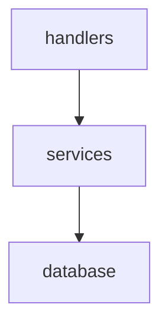

# Module boundaries and layering

This document is the authoritative boundary policy for `apps/visualizer/backend-ts/src/`.

## Layers

```mermaid
flowchart TB
    handlers --> services
    services --> database
```

Route groups and job handlers live above the library: they translate HTTP and job
metadata into calls into the service modules. Nothing below the handler layer knows
about `Context`, request parsing or response shaping.

## What belongs in each layer

- **HTTP routes and job handlers** (`api/`, `jobs/`) — routing, request parsing, response shaping, progress callbacks into the job runner, and thin delegation to the services.
- **Services** (`analyzer/`, `clip/`, `identity/`, `imaging/`, `lightroom/`, `providers/`, `vision/`) — domain logic: analysis, scoring, identity, embeddings, RAW decode, catalog reading and the provider stack.
- **Database layer** (`db/library/`, `db/jobs/`) — persistence: SQL, schema, and the catalog/library write paths (see [ADR-0002](adr/0002-split-database.md)). `db/library/bootstrap.ts` owns the `library.db` schema.
- **Shared utilities** (`utils/`, `constants/`) — errors, datetime, path resolution and response helpers used across layers.

## Import rules

1. Service and database modules **must not** import from `api/` or `jobs/`.
2. Route modules under `api/` may import services and `db/`, but **must not** import sibling route modules — for example `api/identity.ts` must not import `api/images/catalog.ts`, and `api/scores.ts` must not import `api/perspectives.ts`. Coupling between API areas goes through `api/route-helpers.ts`, `api/schemas/` or downward into the service layer. `api/openapi.ts` and `api/schemas/` are exempt — every route group is expected to import them.
3. `cli/` sits alongside `api/` as a second entry point over the same services; it must not import from `api/` or `jobs/`.

## History

Until the TypeScript cutover this policy governed a Python package at
`lightroom_tagger/` and a Flask backend at `apps/visualizer/backend/`, with the
layer split enforced by `test_architecture.py` and a 400-line cap on
`lightroom_tagger/core/` (`make check-core-sizes`). The Flask tree is gone and the
rules above are the same boundaries restated for the tree that replaced it.

`lightroom_tagger/` is still on disk but nothing runs it. It is kept for one
reason: `db/library/bootstrap.ts` creates the schema at version 8 and refuses any
`library.db` below that, so the Python migration ladder in
`core/database/db_init_migrations.py` is the only way to open an older backup. See
[docs/plans/ts-backend-migration.md](plans/ts-backend-migration.md).
