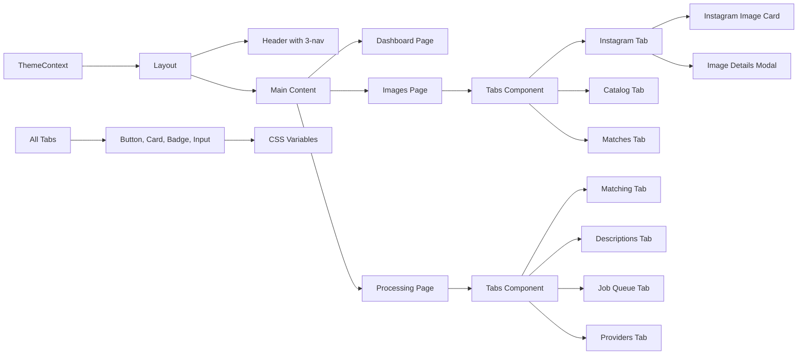

# Frontend UI Redesign - Light-First with Dark Mode

> **For agentic workers:** REQUIRED SUB-SKILL: Use superpowers:subagent-driven-development (recommended) or superpowers:executing-plans to implement this plan task-by-task. Steps use checkbox (`- [ ]`) syntax for tracking.

**Goal:** Transform Lightroom Tagger frontend with warm minimalist design system, consolidated 3-section navigation (Dashboard | Images | Processing), light-first + dark mode support, and proper component architecture.

**Architecture:** Component-driven redesign using Tailwind + CSS variables, React Context for dark mode, reusable UI components in folder structure with index exports. New navigation: Dashboard (overview) → Images (3 tabs: Instagram/Catalog/Matches) → Processing (4 tabs: Matching/Descriptions/Jobs/Providers). Frontend-only - backend untouched.

**Tech Stack:** React 18, TypeScript, Tailwind CSS 3, Vite, Inter font via Google Fonts CDN

**Design Principles (DRY + KISS):**
- Warm neutrals (`#f6f5f4` light, `#31302e` dark)
- Ultra-thin borders (`rgba(0,0,0,0.1)` / `rgba(255,255,255,0.1)`)
- Single accent color (blue `#0075de` light, `#62aef0` dark)
- 8px base spacing
- Multi-layer subtle shadows
- Semantic CSS class names (no framework references)

---

## File Structure

### New Files
```
src/
├── theme/
│   └── colors.ts                    # Color tokens light/dark
├── contexts/
│   └── ThemeContext.tsx             # Dark mode state
├── components/
│   ├── ui/
│   │   ├── ThemeToggle.tsx          # Dark mode toggle
│   │   ├── Tabs/
│   │   │   ├── Tabs.tsx             # Tab navigation
│   │   │   └── index.ts
│   │   ├── Button/
│   │   │   ├── Button.tsx
│   │   │   └── index.ts
│   │   ├── Card/
│   │   │   ├── Card.tsx
│   │   │   ├── CardHeader.tsx
│   │   │   ├── CardTitle.tsx
│   │   │   ├── CardContent.tsx
│   │   │   └── index.ts
│   │   ├── Badge/
│   │   │   ├── Badge.tsx
│   │   │   └── index.ts
│   │   └── Input/
│   │       ├── Input.tsx
│   │       └── index.ts
│   ├── images/
│   │   ├── InstagramTab.tsx         # Instagram gallery tab
│   │   ├── CatalogTab.tsx           # Catalog gallery tab
│   │   ├── MatchesTab.tsx           # Match review tab
│   │   └── MatchPairCard.tsx        # Side-by-side match card
│   └── processing/
│       ├── MatchingTab.tsx          # Vision matching form
│       ├── DescriptionsTab.tsx      # Description generation form
│       ├── JobQueueTab.tsx          # Jobs table
│       └── ProvidersTab.tsx         # Provider config
├── pages/
│   ├── ImagesPage.tsx               # New: Images with 3 tabs
│   └── ProcessingPage.tsx           # New: Processing with 4 tabs
└── DESIGN.md                         # Design system docs
```

### Modified Files
- `tailwind.config.js` - Color palette, semantic class names
- `src/index.css` - Inter font, CSS variables
- `src/App.tsx` - ThemeProvider, update routes
- `src/components/Layout.tsx` - 3-section nav
- `src/components/instagram/InstagramImageCard.tsx` - Semantic classes
- `src/components/instagram/ImageDetailsModal.tsx` - Semantic classes
- `src/components/ui/Pagination.tsx` - Semantic classes

### Removed Files (Consolidated into Tabs)
- `src/pages/InstagramPage.tsx` → `InstagramTab.tsx`
- `src/pages/MatchingPage.tsx` → `MatchingTab.tsx`
- `src/pages/DescriptionsPage.tsx` → `DescriptionsTab.tsx`
- `src/pages/JobsPage.tsx` → `JobQueueTab.tsx`
- `src/pages/ProvidersPage.tsx` → `ProvidersTab.tsx`

---

## Task 1: Foundation - Theme System

**Files:**
- Modify: `apps/visualizer/frontend/tailwind.config.js`
- Modify: `apps/visualizer/frontend/src/index.css`
- Create: `apps/visualizer/frontend/src/theme/colors.ts`

- [ ] **Step 1: Create color token system**

Create `apps/visualizer/frontend/src/theme/colors.ts`:

```typescript
export const colors = {
  light: {
    background: '#ffffff',
    surface: '#f6f5f4',
    surfaceHover: '#f1f0ed',
    textPrimary: 'rgba(0,0,0,0.95)',
    textSecondary: '#615d59',
    textTertiary: '#a39e98',
    border: 'rgba(0,0,0,0.1)',
    borderStrong: 'rgba(0,0,0,0.15)',
    accent: '#0075de',
    accentHover: '#005bab',
    accentLight: '#f2f9ff',
    success: '#1aae39',
    warning: '#dd5b00',
    error: '#e03e3e',
  },
  dark: {
    background: '#191919',
    surface: '#31302e',
    surfaceHover: '#3d3b38',
    textPrimary: '#f7f6f5',
    textSecondary: '#9b9a97',
    textTertiary: '#6f6e69',
    border: 'rgba(255,255,255,0.1)',
    borderStrong: 'rgba(255,255,255,0.15)',
    accent: '#62aef0',
    accentHover: '#97c9ff',
    accentLight: 'rgba(98,174,240,0.1)',
    success: '#2a9d99',
    warning: '#ff8c42',
    error: '#ff6b6b',
  }
} as const;

export type ThemeColors = typeof colors.light;
export type ThemeMode = 'light' | 'dark';
```

- [ ] **Step 2: Update Tailwind config**

Replace `apps/visualizer/frontend/tailwind.config.js`:

```javascript
/** @type {import('tailwindcss').Config} */
export default {
  content: [
    "./index.html",
    "./src/**/*.{js,ts,jsx,tsx}",
  ],
  darkMode: 'class',
  theme: {
    extend: {
      colors: {
        'bg': 'var(--color-background)',
        'surface': 'var(--color-surface)',
        'surface-hover': 'var(--color-surface-hover)',
        'text': 'var(--color-text-primary)',
        'text-secondary': 'var(--color-text-secondary)',
        'text-tertiary': 'var(--color-text-tertiary)',
        'border': 'var(--color-border)',
        'border-strong': 'var(--color-border-strong)',
        'accent': 'var(--color-accent)',
        'accent-hover': 'var(--color-accent-hover)',
        'accent-light': 'var(--color-accent-light)',
        'success': 'var(--color-success)',
        'warning': 'var(--color-warning)',
        'error': 'var(--color-error)',
      },
      fontFamily: {
        sans: ['Inter', '-apple-system', 'system-ui', 'Segoe UI', 'Helvetica', 'Arial', 'sans-serif'],
      },
      fontSize: {
        'hero': ['64px', { lineHeight: '1.0', letterSpacing: '-2.125px', fontWeight: '700' }],
        'section': ['48px', { lineHeight: '1.0', letterSpacing: '-1.5px', fontWeight: '700' }],
        'subsection': ['26px', { lineHeight: '1.23', letterSpacing: '-0.625px', fontWeight: '700' }],
        'card-title': ['22px', { lineHeight: '1.27', letterSpacing: '-0.25px', fontWeight: '700' }],
        'body-lg': ['20px', { lineHeight: '1.40', letterSpacing: '-0.125px', fontWeight: '600' }],
      },
      boxShadow: {
        'card': 'rgba(0,0,0,0.04) 0px 4px 18px, rgba(0,0,0,0.027) 0px 2.025px 7.84688px, rgba(0,0,0,0.02) 0px 0.8px 2.925px, rgba(0,0,0,0.01) 0px 0.175px 1.04062px',
        'deep': 'rgba(0,0,0,0.01) 0px 1px 3px, rgba(0,0,0,0.02) 0px 3px 7px, rgba(0,0,0,0.02) 0px 7px 15px, rgba(0,0,0,0.04) 0px 14px 28px, rgba(0,0,0,0.05) 0px 23px 52px',
      },
      borderRadius: {
        'base': '8px',
        'card': '12px',
      },
    },
  },
  plugins: [],
}
```

- [ ] **Step 3: Add CSS variables for theme switching**

Replace `apps/visualizer/frontend/src/index.css`:

```css
@import url('https://fonts.googleapis.com/css2?family=Inter:wght@400;500;600;700&display=swap');

@tailwind base;
@tailwind components;
@tailwind utilities;

:root {
  --color-background: #ffffff;
  --color-surface: #f6f5f4;
  --color-surface-hover: #f1f0ed;
  --color-text-primary: rgba(0,0,0,0.95);
  --color-text-secondary: #615d59;
  --color-text-tertiary: #a39e98;
  --color-border: rgba(0,0,0,0.1);
  --color-border-strong: rgba(0,0,0,0.15);
  --color-accent: #0075de;
  --color-accent-hover: #005bab;
  --color-accent-light: #f2f9ff;
  --color-success: #1aae39;
  --color-warning: #dd5b00;
  --color-error: #e03e3e;
}

.dark {
  --color-background: #191919;
  --color-surface: #31302e;
  --color-surface-hover: #3d3b38;
  --color-text-primary: #f7f6f5;
  --color-text-secondary: #9b9a97;
  --color-text-tertiary: #6f6e69;
  --color-border: rgba(255,255,255,0.1);
  --color-border-strong: rgba(255,255,255,0.15);
  --color-accent: #62aef0;
  --color-accent-hover: #97c9ff;
  --color-accent-light: rgba(98,174,240,0.1);
  --color-success: #2a9d99;
  --color-warning: #ff8c42;
  --color-error: #ff6b6b;
}

body {
  margin: 0;
  font-family: 'Inter', -apple-system, BlinkMacSystemFont, 'Segoe UI', 'Roboto', sans-serif;
  -webkit-font-smoothing: antialiased;
  -moz-osx-font-smoothing: grayscale;
  background-color: var(--color-background);
  color: var(--color-text-primary);
  transition: background-color 0.2s ease, color 0.2s ease;
}
```

- [ ] **Step 4: Build and verify**

```bash
cd apps/visualizer/frontend
npm run build
```

Expected: Build succeeds, no errors

- [ ] **Step 5: Commit foundation**

```bash
git add apps/visualizer/frontend/tailwind.config.js apps/visualizer/frontend/src/index.css apps/visualizer/frontend/src/theme/colors.ts
git commit -m "feat(frontend): add theme foundation with semantic color system"
```

---

## Task 2: Dark Mode Context

**Files:**
- Create: `apps/visualizer/frontend/src/contexts/ThemeContext.tsx`
- Create: `apps/visualizer/frontend/src/components/ui/ThemeToggle.tsx`
- Modify: `apps/visualizer/frontend/src/App.tsx`

- [ ] **Step 1: Create theme context**

Create `apps/visualizer/frontend/src/contexts/ThemeContext.tsx`:

```typescript
import { createContext, useContext, useEffect, useState, ReactNode } from 'react';

type ThemeMode = 'light' | 'dark';

interface ThemeContextType {
  mode: ThemeMode;
  toggleMode: () => void;
  setMode: (mode: ThemeMode) => void;
}

const ThemeContext = createContext<ThemeContextType | undefined>(undefined);

export function ThemeProvider({ children }: { children: ReactNode }) {
  const [mode, setModeState] = useState<ThemeMode>(() => {
    const stored = localStorage.getItem('theme-mode');
    if (stored === 'light' || stored === 'dark') return stored;
    if (window.matchMedia('(prefers-color-scheme: dark)').matches) return 'dark';
    return 'light';
  });

  useEffect(() => {
    const root = document.documentElement;
    if (mode === 'dark') {
      root.classList.add('dark');
    } else {
      root.classList.remove('dark');
    }
    localStorage.setItem('theme-mode', mode);
  }, [mode]);

  const toggleMode = () => setModeState(prev => prev === 'light' ? 'dark' : 'light');
  const setMode = (newMode: ThemeMode) => setModeState(newMode);

  return (
    <ThemeContext.Provider value={{ mode, toggleMode, setMode }}>
      {children}
    </ThemeContext.Provider>
  );
}

export function useTheme() {
  const context = useContext(ThemeContext);
  if (!context) throw new Error('useTheme must be used within ThemeProvider');
  return context;
}
```

- [ ] **Step 2: Create theme toggle button**

Create `apps/visualizer/frontend/src/components/ui/ThemeToggle.tsx`:

```typescript
import { useTheme } from '../../contexts/ThemeContext';

export function ThemeToggle() {
  const { mode, toggleMode } = useTheme();
  
  return (
    <button
      onClick={toggleMode}
      className="p-2 rounded-base border border-border hover:bg-surface transition-colors"
      aria-label={`Switch to ${mode === 'light' ? 'dark' : 'light'} mode`}
    >
      {mode === 'light' ? (
        <svg className="w-5 h-5 text-text-secondary" fill="none" stroke="currentColor" viewBox="0 0 24 24">
          <path strokeLinecap="round" strokeLinejoin="round" strokeWidth={2} d="M20.354 15.354A9 9 0 018.646 3.646 9.003 9.003 0 0012 21a9.003 9.003 0 008.354-5.646z" />
        </svg>
      ) : (
        <svg className="w-5 h-5 text-text-secondary" fill="none" stroke="currentColor" viewBox="0 0 24 24">
          <path strokeLinecap="round" strokeLinejoin="round" strokeWidth={2} d="M12 3v1m0 16v1m9-9h-1M4 12H3m15.364 6.364l-.707-.707M6.343 6.343l-.707-.707m12.728 0l-.707.707M6.343 17.657l-.707.707M16 12a4 4 0 11-8 0 4 4 0 018 0z" />
        </svg>
      )}
    </button>
  );
}
```

- [ ] **Step 3: Wrap App with ThemeProvider**

Update `apps/visualizer/frontend/src/App.tsx`:

```typescript
import { BrowserRouter as Router, Routes, Route } from 'react-router-dom'
import { Layout } from './components/Layout'
import { ErrorBoundary } from './components/ui/ErrorBoundary'
import { DashboardPage } from './pages/DashboardPage'
import { ImagesPage } from './pages/ImagesPage'
import { ProcessingPage } from './pages/ProcessingPage'
import { MatchOptionsProvider } from './stores/matchOptionsContext'
import { ThemeProvider } from './contexts/ThemeContext'

function App() {
  return (
    <ThemeProvider>
      <MatchOptionsProvider>
        <Router>
          <Routes>
            <Route path="/" element={<Layout />}>
              <Route index element={<ErrorBoundary><DashboardPage /></ErrorBoundary>} />
              <Route path="images" element={<ErrorBoundary><ImagesPage /></ErrorBoundary>} />
              <Route path="processing" element={<ErrorBoundary><ProcessingPage /></ErrorBoundary>} />
            </Route>
          </Routes>
        </Router>
      </MatchOptionsProvider>
    </ThemeProvider>
  )
}

export default App
```

- [ ] **Step 4: Commit dark mode system**

```bash
git add apps/visualizer/frontend/src/contexts/ThemeContext.tsx apps/visualizer/frontend/src/components/ui/ThemeToggle.tsx apps/visualizer/frontend/src/App.tsx
git commit -m "feat(frontend): add dark mode context and toggle"
```

---

## Task 3: Add New String Constants

**Files:**
- Modify: `apps/visualizer/frontend/src/constants/strings.ts`

- [ ] **Step 1: Add new navigation and tab strings**

Add to `apps/visualizer/frontend/src/constants/strings.ts` (after existing navigation constants):

```typescript
// Add after existing navigation constants (around line 10)
export const NAV_IMAGES = 'Images'
export const NAV_CATALOG = 'Catalog'
export const NAV_MATCHES = 'Matches'
export const NAV_PROCESSING = 'Processing'
export const NAV_JOB_QUEUE = 'Job Queue'

// Tab labels
export const TAB_INSTAGRAM = 'Instagram'
export const TAB_CATALOG = 'Catalog'
export const TAB_MATCHES = 'Matches'
export const TAB_VISION_MATCHING = 'Vision Matching'
export const TAB_DESCRIPTIONS = 'Descriptions'
export const TAB_JOB_QUEUE = 'Job Queue'
export const TAB_PROVIDERS = 'Providers'

// Placeholders
export const PLACEHOLDER_COMING_SOON = 'Coming soon...'
export const PLACEHOLDER_CATALOG_VIEW = 'Catalog image view coming soon'
export const PLACEHOLDER_MATCHES_VIEW = 'Matches view coming soon'

// Badge labels (for variant prop values, not display strings)
export const BADGE_MATCHED = 'Matched'
export const BADGE_DESCRIBED = 'Described'
export const BADGE_PROCESSED = 'Processed'

// Date display
export const DATE_NO_DATE = 'No date'
export const DATE_ESTIMATED_SUFFIX = '(est.)'

// Image details
export const IMAGE_DETAILS_TITLE = 'Image Details'
export const IMAGE_DETAILS_AI_DESCRIPTION = 'AI Description'
export const LABEL_FOLDER = 'Folder'
export const LABEL_SOURCE = 'Source'
export const LABEL_DATE = 'Date'
export const LABEL_IMAGE_HASH_DISPLAY = 'Image Hash'
export const LABEL_CATALOG_MATCH = 'Catalog Match'
```

- [ ] **Step 2: Commit string constants**

```bash
git add apps/visualizer/frontend/src/constants/strings.ts
git commit -m "feat(frontend): add navigation and UI string constants"
```

---

## Task 4: Core UI Components

**Files:**
- Create: `apps/visualizer/frontend/src/components/ui/Button/Button.tsx`
- Create: `apps/visualizer/frontend/src/components/ui/Button/index.ts`
- Create: `apps/visualizer/frontend/src/components/ui/Card/Card.tsx`
- Create: `apps/visualizer/frontend/src/components/ui/Card/CardHeader.tsx`
- Create: `apps/visualizer/frontend/src/components/ui/Card/CardTitle.tsx`
- Create: `apps/visualizer/frontend/src/components/ui/Card/CardContent.tsx`
- Create: `apps/visualizer/frontend/src/components/ui/Card/index.ts`
- Create: `apps/visualizer/frontend/src/components/ui/Badge/Badge.tsx`
- Create: `apps/visualizer/frontend/src/components/ui/Badge/index.ts`
- Create: `apps/visualizer/frontend/src/components/ui/Input/Input.tsx`
- Create: `apps/visualizer/frontend/src/components/ui/Input/index.ts`

- [ ] **Step 1: Create Button component**

Create `apps/visualizer/frontend/src/components/ui/Button/Button.tsx`:

```typescript
import { ButtonHTMLAttributes, ReactNode } from 'react';

type ButtonVariant = 'primary' | 'secondary' | 'ghost' | 'danger';
type ButtonSize = 'sm' | 'md' | 'lg';

interface ButtonProps extends ButtonHTMLAttributes<HTMLButtonElement> {
  variant?: ButtonVariant;
  size?: ButtonSize;
  fullWidth?: boolean;
  children: ReactNode;
}

const variantClasses: Record<ButtonVariant, string> = {
  primary: 'bg-accent text-white hover:bg-accent-hover border border-accent',
  secondary: 'bg-surface text-text hover:bg-surface-hover border border-border',
  ghost: 'bg-transparent text-text-secondary hover:bg-surface border border-transparent',
  danger: 'bg-error text-white hover:opacity-90 border border-error',
};

const sizeClasses: Record<ButtonSize, string> = {
  sm: 'px-3 py-1.5 text-sm',
  md: 'px-4 py-2 text-base',
  lg: 'px-6 py-3 text-lg',
};

export function Button({
  variant = 'secondary',
  size = 'md',
  fullWidth = false,
  className = '',
  disabled,
  children,
  ...props
}: ButtonProps) {
  return (
    <button
      className={`
        ${variantClasses[variant]}
        ${sizeClasses[size]}
        ${fullWidth ? 'w-full' : ''}
        font-medium rounded-base transition-all duration-150
        focus:outline-none focus:ring-2 focus:ring-accent focus:ring-offset-2
        disabled:opacity-50 disabled:cursor-not-allowed
        ${className}
      `.trim()}
      disabled={disabled}
      {...props}
    >
      {children}
    </button>
  );
}
```

Create `apps/visualizer/frontend/src/components/ui/Button/index.ts`:

```typescript
export { Button } from './Button';
```

- [ ] **Step 2: Create Card components**

Create `apps/visualizer/frontend/src/components/ui/Card/Card.tsx`:

```typescript
import { ReactNode } from 'react';

interface CardProps {
  children: ReactNode;
  className?: string;
  onClick?: () => void;
  hoverable?: boolean;
  padding?: 'none' | 'sm' | 'md' | 'lg';
}

const paddingClasses = {
  none: '',
  sm: 'p-3',
  md: 'p-4',
  lg: 'p-6',
};

export function Card({
  children,
  className = '',
  onClick,
  hoverable = false,
  padding = 'md',
}: CardProps) {
  return (
    <div
      className={`
        bg-bg border border-border rounded-card
        shadow-card transition-all duration-150
        ${paddingClasses[padding]}
        ${hoverable || onClick ? 'hover:shadow-deep hover:border-border-strong cursor-pointer' : ''}
        ${className}
      `.trim()}
      onClick={onClick}
    >
      {children}
    </div>
  );
}
```

Create `apps/visualizer/frontend/src/components/ui/Card/CardHeader.tsx`:

```typescript
import { ReactNode } from 'react';

interface CardHeaderProps {
  children: ReactNode;
  className?: string;
}

export function CardHeader({ children, className = '' }: CardHeaderProps) {
  return <div className={`mb-3 ${className}`}>{children}</div>;
}
```

Create `apps/visualizer/frontend/src/components/ui/Card/CardTitle.tsx`:

```typescript
import { ReactNode } from 'react';

interface CardTitleProps {
  children: ReactNode;
  className?: string;
}

export function CardTitle({ children, className = '' }: CardTitleProps) {
  return (
    <h3 className={`text-card-title text-text font-bold ${className}`}>
      {children}
    </h3>
  );
}
```

Create `apps/visualizer/frontend/src/components/ui/Card/CardContent.tsx`:

```typescript
import { ReactNode } from 'react';

interface CardContentProps {
  children: ReactNode;
  className?: string;
}

export function CardContent({ children, className = '' }: CardContentProps) {
  return (
    <div className={`text-text-secondary ${className}`}>
      {children}
    </div>
  );
}
```

Create `apps/visualizer/frontend/src/components/ui/Card/index.ts`:

```typescript
export { Card } from './Card';
export { CardHeader } from './CardHeader';
export { CardTitle } from './CardTitle';
export { CardContent } from './CardContent';
```

- [ ] **Step 3: Create Badge component**

Create `apps/visualizer/frontend/src/components/ui/Badge/Badge.tsx`:

```typescript
import { ReactNode } from 'react';

type BadgeVariant = 'default' | 'success' | 'warning' | 'error' | 'accent';

interface BadgeProps {
  children: ReactNode;
  variant?: BadgeVariant;
  className?: string;
}

const variantClasses: Record<BadgeVariant, string> = {
  default: 'bg-surface text-text-secondary border-border',
  success: 'bg-green-50 dark:bg-green-900/20 text-success border-green-200 dark:border-green-800',
  warning: 'bg-orange-50 dark:bg-orange-900/20 text-warning border-orange-200 dark:border-orange-800',
  error: 'bg-red-50 dark:bg-red-900/20 text-error border-red-200 dark:border-red-800',
  accent: 'bg-accent-light text-accent border-blue-200 dark:border-blue-800',
};

export function Badge({ children, variant = 'default', className = '' }: BadgeProps) {
  return (
    <span
      className={`
        inline-flex items-center px-2.5 py-0.5 rounded-full text-xs font-medium
        border ${variantClasses[variant]} ${className}
      `.trim()}
    >
      {children}
    </span>
  );
}
```

Create `apps/visualizer/frontend/src/components/ui/Badge/index.ts`:

```typescript
export { Badge } from './Badge';
```

- [ ] **Step 4: Create Input component**

Create `apps/visualizer/frontend/src/components/ui/Input/Input.tsx`:

```typescript
import { InputHTMLAttributes, forwardRef } from 'react';

interface InputProps extends InputHTMLAttributes<HTMLInputElement> {
  label?: string;
  error?: string;
  fullWidth?: boolean;
}

export const Input = forwardRef<HTMLInputElement, InputProps>(
  ({ label, error, fullWidth = false, className = '', ...props }, ref) => {
    return (
      <div className={fullWidth ? 'w-full' : ''}>
        {label && (
          <label className="block text-sm font-medium text-text-secondary mb-1.5">
            {label}
          </label>
        )}
        <input
          ref={ref}
          className={`
            px-3 py-2 rounded-base border border-border
            bg-bg text-text placeholder-text-tertiary
            focus:outline-none focus:ring-2 focus:ring-accent focus:border-transparent
            hover:border-border-strong
            disabled:opacity-50 disabled:cursor-not-allowed
            transition-all duration-150
            ${fullWidth ? 'w-full' : ''}
            ${error ? 'border-error focus:ring-error' : ''}
            ${className}
          `.trim()}
          {...props}
        />
        {error && (
          <p className="mt-1 text-sm text-error">{error}</p>
        )}
      </div>
    );
  }
);

Input.displayName = 'Input';
```

Create `apps/visualizer/frontend/src/components/ui/Input/index.ts`:

```typescript
export { Input } from './Input';
```

- [ ] **Step 5: Commit core components**

```bash
git add apps/visualizer/frontend/src/components/ui/Button/ apps/visualizer/frontend/src/components/ui/Card/ apps/visualizer/frontend/src/components/ui/Badge/ apps/visualizer/frontend/src/components/ui/Input/
git commit -m "feat(frontend): add core UI components with proper folder structure"
```

---

## Task 5: Tabs Component

**Files:**
- Create: `apps/visualizer/frontend/src/components/ui/Tabs/Tabs.tsx`
- Create: `apps/visualizer/frontend/src/components/ui/Tabs/index.ts`

- [ ] **Step 1: Create reusable Tabs component**

Create `apps/visualizer/frontend/src/components/ui/Tabs/Tabs.tsx`:

```typescript
import { ReactNode } from 'react';

export interface Tab {
  id: string;
  label: string;
  content: ReactNode;
}

interface TabsProps {
  tabs: Tab[];
  activeTab: string;
  onTabChange: (tabId: string) => void;
  className?: string;
}

export function Tabs({ tabs, activeTab, onTabChange, className = '' }: TabsProps) {
  return (
    <div className={className}>
      {/* Tab navigation */}
      <div className="border-b border-border">
        <nav className="flex space-x-1 overflow-x-auto">
          {tabs.map((tab) => (
            <button
              key={tab.id}
              onClick={() => onTabChange(tab.id)}
              className={`
                px-4 py-2.5 text-sm font-medium whitespace-nowrap
                border-b-2 transition-all duration-150
                ${
                  activeTab === tab.id
                    ? 'border-accent text-accent'
                    : 'border-transparent text-text-secondary hover:text-text hover:border-border'
                }
              `.trim()}
            >
              {tab.label}
            </button>
          ))}
        </nav>
      </div>

      {/* Tab content */}
      <div className="mt-6">
        {tabs.find((tab) => tab.id === activeTab)?.content}
      </div>
    </div>
  );
}
```

Create `apps/visualizer/frontend/src/components/ui/Tabs/index.ts`:

```typescript
export { Tabs } from './Tabs';
export type { Tab } from './Tabs';
```

- [ ] **Step 2: Commit Tabs component**

```bash
git add apps/visualizer/frontend/src/components/ui/Tabs/
git commit -m "feat(frontend): add reusable Tabs component"
```

---

## Task 6: Update Layout with 3-Section Navigation

**Files:**
- Modify: `apps/visualizer/frontend/src/components/Layout.tsx`

- [ ] **Step 1: Redesign Layout with consolidated nav**

Replace entire content of `apps/visualizer/frontend/src/components/Layout.tsx`:

```typescript
import { Outlet, NavLink } from 'react-router-dom';
import { ThemeToggle } from './ui/ThemeToggle';
import { 
  APP_TITLE, 
  NAV_DASHBOARD, 
  NAV_IMAGES, 
  NAV_PROCESSING 
} from '../constants/strings';

export function Layout() {
  const navItems = [
    { to: '/', label: NAV_DASHBOARD, exact: true },
    { to: '/images', label: NAV_IMAGES },
    { to: '/processing', label: NAV_PROCESSING },
  ];

  return (
    <div className="min-h-screen bg-bg transition-colors duration-200">
      <header className="sticky top-0 z-50 bg-bg/95 backdrop-blur-sm border-b border-border">
        <div className="max-w-7xl mx-auto px-4 sm:px-6 lg:px-8">
          <div className="flex items-center justify-between h-16">
            <div className="flex items-center space-x-8">
              <h1 className="text-lg font-semibold text-text">{APP_TITLE}</h1>

              <nav className="hidden md:flex items-center space-x-1">
                {navItems.map((item) => (
                  <NavLink
                    key={item.to}
                    to={item.to}
                    end={item.exact}
                    className={({ isActive }) =>
                      `px-3 py-1.5 rounded-base text-sm font-medium transition-all duration-150
                      ${isActive ? 'bg-accent-light text-accent' : 'text-text-secondary hover:bg-surface hover:text-text'}`
                    }
                  >
                    {item.label}
                  </NavLink>
                ))}
              </nav>
            </div>

            <ThemeToggle />
          </div>
        </div>

        <div className="md:hidden border-t border-border">
          <nav className="px-4 py-2 flex overflow-x-auto space-x-1">
            {navItems.map((item) => (
              <NavLink
                key={item.to}
                to={item.to}
                end={item.exact}
                className={({ isActive }) =>
                  `px-3 py-1.5 rounded-base text-sm font-medium whitespace-nowrap transition-all
                  ${isActive ? 'bg-accent-light text-accent' : 'text-text-secondary hover:bg-surface'}`
                }
              >
                {item.label}
              </NavLink>
            ))}
          </nav>
        </div>
      </header>

      <main className="max-w-7xl mx-auto px-4 sm:px-6 lg:px-8 py-8">
        <Outlet />
      </main>
    </div>
  );
}
```

- [ ] **Step 2: Commit layout**

```bash
git add apps/visualizer/frontend/src/components/Layout.tsx
git commit -m "feat(frontend): consolidate navigation to 3 sections"
```

---

## Task 7: Create Images Page with 3 Tabs

**Files:**
- Create: `apps/visualizer/frontend/src/pages/ImagesPage.tsx`
- Create: `apps/visualizer/frontend/src/components/images/InstagramTab.tsx`
- Create: `apps/visualizer/frontend/src/components/images/CatalogTab.tsx`
- Create: `apps/visualizer/frontend/src/components/images/MatchesTab.tsx`

- [ ] **Step 1: Create ImagesPage with tab navigation**

Create `apps/visualizer/frontend/src/pages/ImagesPage.tsx`:

```typescript
import { useState } from 'react';
import { Tabs, Tab } from '../components/ui/Tabs';
import { InstagramTab } from '../components/images/InstagramTab';
import { CatalogTab } from '../components/images/CatalogTab';
import { MatchesTab } from '../components/images/MatchesTab';
import { TAB_INSTAGRAM, TAB_CATALOG, TAB_MATCHES } from '../constants/strings';

export function ImagesPage() {
  const [activeTab, setActiveTab] = useState('instagram');

  const tabs: Tab[] = [
    { id: 'instagram', label: TAB_INSTAGRAM, content: <InstagramTab /> },
    { id: 'catalog', label: TAB_CATALOG, content: <CatalogTab /> },
    { id: 'matches', label: TAB_MATCHES, content: <MatchesTab /> },
  ];

  return (
    <div>
      <div className="mb-6">
        <h1 className="text-section text-text mb-2">Images</h1>
        <p className="text-text-secondary">
          Browse Instagram photos, catalog images, and review matched pairs
        </p>
      </div>

      <Tabs tabs={tabs} activeTab={activeTab} onTabChange={setActiveTab} />
    </div>
  );
}
```

- [ ] **Step 2: Create InstagramTab (move from InstagramPage)**

Create `apps/visualizer/frontend/src/components/images/InstagramTab.tsx`:

```typescript
import { useCallback, useEffect, useState } from 'react';
import { PageError, SkeletonGrid } from '../ui/page-states';
import { ImageDetailsModal } from '../instagram/ImageDetailsModal';
import { InstagramImageCard } from '../instagram/InstagramImageCard';
import { Pagination } from '../ui/Pagination';
import { FILTER_ALL_DATES, FILTER_CLEAR, ITEMS_PER_PAGE } from '../../constants/strings';
import { useModal } from '../../hooks/useModal';
import type { InstagramImage } from '../../services/api';
import { ImagesAPI } from '../../services/api';
import { formatMonth } from '../../utils/date';

export function InstagramTab() {
  const [images, setImages] = useState<InstagramImage[]>([]);
  const [total, setTotal] = useState(0);
  const [error, setError] = useState<string | null>(null);
  const [pagination, setPagination] = useState({
    current_page: 1,
    total_pages: 1,
    has_more: false,
  });
  const [dateFilter, setDateFilter] = useState('');
  const [availableMonths, setAvailableMonths] = useState<string[]>([]);
  const [isLoading, setIsLoading] = useState(false);

  const { isOpen, selectedItem, open, close } = useModal<InstagramImage>();

  const fetchImages = useCallback(
    async (newOffset: number, filter: string = dateFilter) => {
      setIsLoading(true);
      try {
        const params = {
          limit: ITEMS_PER_PAGE,
          offset: newOffset,
          ...(filter && { date_folder: filter }),
        };
        const data = await ImagesAPI.listInstagram(params);
        setImages(data.images);
        setTotal(data.total);
        setPagination(data.pagination);
        setError(null);
      } catch (err) {
        setError(err instanceof Error ? err.message : 'Unknown error');
      } finally {
        setIsLoading(false);
      }
    },
    [dateFilter]
  );

  useEffect(() => {
    const initialize = async () => {
      setIsLoading(true);
      try {
        const [monthsData, firstPageData] = await Promise.all([
          ImagesAPI.getInstagramMonths(),
          ImagesAPI.listInstagram({ limit: ITEMS_PER_PAGE, offset: 0 }),
        ]);
        setAvailableMonths(monthsData.months);
        setImages(firstPageData.images);
        setTotal(firstPageData.total);
        setPagination(firstPageData.pagination);
        setError(null);
      } catch (err) {
        setError(err instanceof Error ? err.message : 'Unknown error');
      } finally {
        setIsLoading(false);
      }
    };
    initialize();
  }, []);

  const handlePageChange = (page: number) => {
    const newOffset = (page - 1) * ITEMS_PER_PAGE;
    fetchImages(newOffset);
  };

  const handleFilterChange = (filter: string) => {
    setDateFilter(filter);
    fetchImages(0, filter);
  };

  const clearFilter = () => {
    setDateFilter('');
    fetchImages(0, '');
  };

  return (
    <div className="space-y-6">
      <div className="flex items-center justify-between">
        <p className="text-sm text-text-secondary">
          {total.toLocaleString()} images total
        </p>

        {availableMonths.length > 0 && (
          <div className="flex items-center space-x-2">
            <select
              value={dateFilter}
              onChange={(e) => handleFilterChange(e.target.value)}
              className="px-3 py-2 rounded-base border border-border bg-bg text-text text-sm focus:outline-none focus:ring-2 focus:ring-accent hover:border-border-strong transition-all"
            >
              <option value="">{FILTER_ALL_DATES}</option>
              {availableMonths.map((month) => (
                <option key={month} value={month}>
                  {formatMonth(month)}
                </option>
              ))}
            </select>
            {dateFilter && (
              <button
                onClick={clearFilter}
                className="px-3 py-2 text-sm rounded-base border border-border bg-bg text-text-secondary hover:bg-surface hover:text-text transition-all"
              >
                {FILTER_CLEAR}
              </button>
            )}
          </div>
        )}
      </div>

      {error && <PageError message={error} />}
      {isLoading && <SkeletonGrid count={ITEMS_PER_PAGE} />}

      {!isLoading && !error && (
        <>
          <div className="grid grid-cols-1 sm:grid-cols-2 lg:grid-cols-3 xl:grid-cols-4 gap-4">
            {images.map((image) => (
              <InstagramImageCard key={image.key} image={image} onClick={() => open(image)} />
            ))}
          </div>

          {pagination.total_pages > 1 && (
            <div className="flex justify-center pt-4">
              <Pagination
                currentPage={pagination.current_page}
                totalPages={pagination.total_pages}
                onPageChange={handlePageChange}
              />
            </div>
          )}
        </>
      )}

      {isOpen && selectedItem && <ImageDetailsModal image={selectedItem} onClose={close} />}
    </div>
  );
}
```

- [ ] **Step 3: Create CatalogTab placeholder**

Create `apps/visualizer/frontend/src/components/images/CatalogTab.tsx`:

```typescript
import { Card, CardContent } from '../ui/Card';
import { TAB_CATALOG, PLACEHOLDER_CATALOG_VIEW } from '../../constants/strings';

export function CatalogTab() {
  return (
    <div className="space-y-6">
      <Card padding="lg">
        <CardContent>
          <div className="text-center py-12">
            <svg className="mx-auto h-12 w-12 text-text-tertiary" fill="none" stroke="currentColor" viewBox="0 0 24 24">
              <path strokeLinecap="round" strokeLinejoin="round" strokeWidth={2} d="M4 16l4.586-4.586a2 2 0 012.828 0L16 16m-2-2l1.586-1.586a2 2 0 012.828 0L20 14m-6-6h.01M6 20h12a2 2 0 002-2V6a2 2 0 00-2-2H6a2 2 0 00-2 2v12a2 2 0 002 2z" />
            </svg>
            <h3 className="mt-2 text-sm font-medium text-text">{TAB_CATALOG}</h3>
            <p className="mt-1 text-sm text-text-secondary">
              {PLACEHOLDER_CATALOG_VIEW}
            </p>
          </div>
        </CardContent>
      </Card>
    </div>
  );
}
```

- [ ] **Step 4: Create MatchesTab placeholder**

Create `apps/visualizer/frontend/src/components/images/MatchesTab.tsx`:

```typescript
import { Card, CardContent } from '../ui/Card';
import { TAB_MATCHES, PLACEHOLDER_MATCHES_VIEW } from '../../constants/strings';

export function MatchesTab() {
  return (
    <div className="space-y-6">
      <Card padding="lg">
        <CardContent>
          <div className="text-center py-12">
            <svg className="mx-auto h-12 w-12 text-text-tertiary" fill="none" stroke="currentColor" viewBox="0 0 24 24">
              <path strokeLinecap="round" strokeLinejoin="round" strokeWidth={2} d="M9 12l2 2 4-4m6 2a9 9 0 11-18 0 9 9 0 0118 0z" />
            </svg>
            <h3 className="mt-2 text-sm font-medium text-text">{TAB_MATCHES}</h3>
            <p className="mt-1 text-sm text-text-secondary">
              {PLACEHOLDER_MATCHES_VIEW}
            </p>
          </div>
        </CardContent>
      </Card>
    </div>
  );
}
```

- [ ] **Step 5: Commit Images page and tabs**

```bash
git add apps/visualizer/frontend/src/pages/ImagesPage.tsx apps/visualizer/frontend/src/components/images/
git commit -m "feat(frontend): add Images page with Instagram/Catalog/Matches tabs"
```

---

## Task 8: Create Processing Page with 4 Tabs

**Files:**
- Create: `apps/visualizer/frontend/src/pages/ProcessingPage.tsx`
- Create: `apps/visualizer/frontend/src/components/processing/MatchingTab.tsx`
- Create: `apps/visualizer/frontend/src/components/processing/DescriptionsTab.tsx`
- Create: `apps/visualizer/frontend/src/components/processing/JobQueueTab.tsx`
- Create: `apps/visualizer/frontend/src/components/processing/ProvidersTab.tsx`

- [ ] **Step 1: Create ProcessingPage with tab navigation**

Create `apps/visualizer/frontend/src/pages/ProcessingPage.tsx`:

```typescript
import { useState } from 'react';
import { Tabs, Tab } from '../components/ui/Tabs';
import { MatchingTab } from '../components/processing/MatchingTab';
import { DescriptionsTab } from '../components/processing/DescriptionsTab';
import { JobQueueTab } from '../components/processing/JobQueueTab';
import { ProvidersTab } from '../components/processing/ProvidersTab';
import { 
  TAB_VISION_MATCHING, 
  TAB_DESCRIPTIONS, 
  TAB_JOB_QUEUE, 
  TAB_PROVIDERS,
  NAV_PROCESSING 
} from '../constants/strings';

export function ProcessingPage() {
  const [activeTab, setActiveTab] = useState('matching');

  const tabs: Tab[] = [
    { id: 'matching', label: TAB_VISION_MATCHING, content: <MatchingTab /> },
    { id: 'descriptions', label: TAB_DESCRIPTIONS, content: <DescriptionsTab /> },
    { id: 'jobs', label: TAB_JOB_QUEUE, content: <JobQueueTab /> },
    { id: 'providers', label: TAB_PROVIDERS, content: <ProvidersTab /> },
  ];

  return (
    <div>
      <div className="mb-6">
        <h1 className="text-section text-text mb-2">{NAV_PROCESSING}</h1>
        <p className="text-text-secondary">
          AI-powered vision matching, description generation, and job monitoring
        </p>
      </div>

      <Tabs tabs={tabs} activeTab={activeTab} onTabChange={setActiveTab} />
    </div>
  );
}
```

- [ ] **Step 2: Create MatchingTab (move from MatchingPage)**

Create `apps/visualizer/frontend/src/components/processing/MatchingTab.tsx`:

```typescript
import { useState, useCallback } from 'react';
import { Card, CardHeader, CardTitle, CardContent } from '../ui/Card';
import { Button } from '../ui/Button';
import { useMatchOptions } from '../../stores/matchOptionsContext';
import { AdvancedOptions } from '../matching/AdvancedOptions';
import { JobsAPI } from '../../services/api';
import {
  ADVANCED_OPTIONS_TITLE,
  ADVANCED_DATE_ALL,
  ADVANCED_DATE_3MONTHS,
  ADVANCED_DATE_6MONTHS,
  ADVANCED_DATE_12MONTHS,
  ADVANCED_DATE_YEAR_2026,
  ADVANCED_DATE_YEAR_2025,
  ADVANCED_DATE_YEAR_2024,
  ADVANCED_DATE_YEAR_2023,
} from '../../constants/strings';

const DATE_FILTERS = [
  { value: 'all', label: ADVANCED_DATE_ALL },
  { value: '3months', label: ADVANCED_DATE_3MONTHS },
  { value: '6months', label: ADVANCED_DATE_6MONTHS },
  { value: '12months', label: ADVANCED_DATE_12MONTHS },
  { value: '2026', label: ADVANCED_DATE_YEAR_2026 },
  { value: '2025', label: ADVANCED_DATE_YEAR_2025 },
  { value: '2024', label: ADVANCED_DATE_YEAR_2024 },
  { value: '2023', label: ADVANCED_DATE_YEAR_2023 },
] as const;

export function MatchingTab() {
  const [dateFilter, setDateFilter] = useState('all');
  const [showAdvanced, setShowAdvanced] = useState(false);
  const [isStarting, setIsStarting] = useState(false);
  const { matchOptions, updateMatchOptions } = useMatchOptions();

  const startMatching = useCallback(async () => {
    setIsStarting(true);
    try {
      const metadata: Record<string, any> = {
        max_workers: matchOptions.maxWorkers,
        use_vision: matchOptions.useVisionComparison,
      };

      if (dateFilter === '3months') metadata.last_months = 3;
      else if (dateFilter === '6months') metadata.last_months = 6;
      else if (dateFilter === '12months') metadata.last_months = 12;
      else if (dateFilter === '2026') metadata.year = '2026';
      else if (dateFilter === '2025') metadata.year = '2025';
      else if (dateFilter === '2024') metadata.year = '2024';
      else if (dateFilter === '2023') metadata.year = '2023';

      await JobsAPI.create('vision_match', metadata);
      alert('Vision matching job started! Check Job Queue tab to monitor progress.');
    } catch (error) {
      alert(`Failed to start job: ${error instanceof Error ? error.message : 'Unknown error'}`);
    } finally {
      setIsStarting(false);
    }
  }, [dateFilter, matchOptions]);

  return (
    <div className="max-w-2xl">
      <Card padding="lg">
        <CardHeader>
          <CardTitle>Start Vision Matching Job</CardTitle>
        </CardHeader>

        <CardContent>
          <div className="space-y-6">
            <div>
              <label className="block text-sm font-medium text-text mb-2">
                Date Filter
              </label>
              <select
                value={dateFilter}
                onChange={(e) => setDateFilter(e.target.value)}
                className="w-full px-3 py-2 rounded-base border border-border bg-bg text-text focus:outline-none focus:ring-2 focus:ring-accent hover:border-border-strong transition-all"
              >
                {DATE_FILTERS.map((filter) => (
                  <option key={filter.value} value={filter.value}>
                    {filter.label}
                  </option>
                ))}
              </select>
            </div>

            <div>
              <button
                onClick={() => setShowAdvanced(!showAdvanced)}
                className="flex items-center space-x-2 text-sm font-medium text-accent hover:text-accent-hover transition-colors"
              >
                <svg
                  className={`w-4 h-4 transition-transform ${showAdvanced ? 'rotate-90' : ''}`}
                  fill="none"
                  stroke="currentColor"
                  viewBox="0 0 24 24"
                >
                  <path strokeLinecap="round" strokeLinejoin="round" strokeWidth={2} d="M9 5l7 7-7 7" />
                </svg>
                <span>{ADVANCED_OPTIONS_TITLE}</span>
              </button>
            </div>

            {showAdvanced && (
              <div className="pt-4 border-t border-border">
                <AdvancedOptions
                  useVisionComparison={matchOptions.useVisionComparison}
                  onUseVisionComparisonChange={(value) =>
                    updateMatchOptions({ useVisionComparison: value })
                  }
                  maxWorkers={matchOptions.maxWorkers}
                  onMaxWorkersChange={(value) => updateMatchOptions({ maxWorkers: value })}
                />
              </div>
            )}

            <div className="pt-4">
              <Button variant="primary" size="lg" fullWidth onClick={startMatching} disabled={isStarting}>
                {isStarting ? 'Starting Job...' : 'Start Vision Matching'}
              </Button>
            </div>
          </div>
        </CardContent>
      </Card>
    </div>
  );
}
```

- [ ] **Step 3: Create DescriptionsTab (move from DescriptionsPage - simplified for now)**

Create `apps/visualizer/frontend/src/components/processing/DescriptionsTab.tsx`:

```typescript
import { useState, useCallback } from 'react';
import { Card, CardHeader, CardTitle, CardContent } from '../ui/Card';
import { Button } from '../ui/Button';
import { WorkerSlider } from '../matching/WorkerSlider';
import { JobsAPI } from '../../services/api';
import { ADVANCED_OPTIONS_TITLE } from '../../constants/strings';

export function DescriptionsTab() {
  const [maxWorkers, setMaxWorkers] = useState(2);
  const [showAdvanced, setShowAdvanced] = useState(false);
  const [isStarting, setIsStarting] = useState(false);

  const startDescriptions = useCallback(async () => {
    setIsStarting(true);
    try {
      await JobsAPI.create('batch_describe', { max_workers: maxWorkers });
      alert('Description generation job started! Check Job Queue tab to monitor progress.');
    } catch (error) {
      alert(`Failed to start job: ${error instanceof Error ? error.message : 'Unknown error'}`);
    } finally {
      setIsStarting(false);
    }
  }, [maxWorkers]);

  return (
    <div className="max-w-2xl">
      <Card padding="lg">
        <CardHeader>
          <CardTitle>Generate Image Descriptions</CardTitle>
        </CardHeader>

        <CardContent>
          <div className="space-y-6">
            <p className="text-sm text-text-secondary">
              AI-generated descriptions improve matching accuracy by providing semantic context.
            </p>

            <div>
              <button
                onClick={() => setShowAdvanced(!showAdvanced)}
                className="flex items-center space-x-2 text-sm font-medium text-accent hover:text-accent-hover transition-colors"
              >
                <svg
                  className={`w-4 h-4 transition-transform ${showAdvanced ? 'rotate-90' : ''}`}
                  fill="none"
                  stroke="currentColor"
                  viewBox="0 0 24 24"
                >
                  <path strokeLinecap="round" strokeLinejoin="round" strokeWidth={2} d="M9 5l7 7-7 7" />
                </svg>
                <span>{ADVANCED_OPTIONS_TITLE}</span>
              </button>
            </div>

            {showAdvanced && (
              <div className="pt-4 border-t border-border">
                <WorkerSlider value={maxWorkers} onChange={setMaxWorkers} />
              </div>
            )}

            <div className="pt-4">
              <Button variant="primary" size="lg" fullWidth onClick={startDescriptions} disabled={isStarting}>
                {isStarting ? 'Starting Job...' : 'Generate Descriptions'}
              </Button>
            </div>
          </div>
        </CardContent>
      </Card>
    </div>
  );
}
```

- [ ] **Step 4: Create JobQueueTab (move from JobsPage - simplified)**

Create `apps/visualizer/frontend/src/components/processing/JobQueueTab.tsx`:

```typescript
import { useEffect, useState, useCallback } from 'react';
import { Card } from '../ui/Card';
import { Badge } from '../ui/Badge';
import { Button } from '../ui/Button';
import { JobsAPI } from '../../services/api';

export function JobQueueTab() {
  const [jobs, setJobs] = useState<any[]>([]);
  const [loading, setLoading] = useState(true);

  const loadJobs = useCallback(async () => {
    setLoading(true);
    try {
      const data = await JobsAPI.list();
      setJobs(data.jobs || []);
    } catch (error) {
      console.error('Failed to load jobs:', error);
    } finally {
      setLoading(false);
    }
  }, []);

  useEffect(() => {
    loadJobs();
    const interval = setInterval(loadJobs, 5000);
    return () => clearInterval(interval);
  }, [loadJobs]);

  return (
    <div className="space-y-4">
      <div className="flex justify-end">
        <Button variant="secondary" size="sm" onClick={loadJobs}>
          <svg className="w-4 h-4 mr-2" fill="none" stroke="currentColor" viewBox="0 0 24 24">
            <path strokeLinecap="round" strokeLinejoin="round" strokeWidth={2} d="M4 4v5h.582m15.356 2A8.001 8.001 0 004.582 9m0 0H9m11 11v-5h-.581m0 0a8.003 8.003 0 01-15.357-2m15.357 2H15" />
          </svg>
          Refresh
        </Button>
      </div>

      <Card padding="none">
        <div className="overflow-x-auto">
          <table className="w-full">
            <thead className="border-b border-border">
              <tr className="bg-surface">
                <th className="px-6 py-3 text-left text-xs font-medium text-text-secondary uppercase">Type</th>
                <th className="px-6 py-3 text-left text-xs font-medium text-text-secondary uppercase">Status</th>
                <th className="px-6 py-3 text-left text-xs font-medium text-text-secondary uppercase">Created</th>
                <th className="px-6 py-3 text-left text-xs font-medium text-text-secondary uppercase">Progress</th>
              </tr>
            </thead>
            <tbody className="divide-y divide-border">
              {jobs.map((job) => (
                <tr key={job.id} className="hover:bg-surface transition-colors">
                  <td className="px-6 py-4">
                    <div className="text-sm font-medium text-text">{job.job_type}</div>
                    <div className="text-xs text-text-tertiary">{job.id.substring(0, 8)}</div>
                  </td>
                  <td className="px-6 py-4">
                    <Badge
                      variant={
                        job.status === 'completed' ? 'success' :
                        job.status === 'failed' ? 'error' :
                        job.status === 'running' ? 'accent' : 'default'
                      }
                    >
                      {job.status}
                    </Badge>
                  </td>
                  <td className="px-6 py-4 text-sm text-text-secondary">
                    {new Date(job.created_at).toLocaleString()}
                  </td>
                  <td className="px-6 py-4">
                    {job.status === 'running' && (
                      <div className="w-full bg-surface rounded-full h-2">
                        <div
                          className="bg-accent h-2 rounded-full transition-all duration-300"
                          style={{ width: `${(job.progress || 0) * 100}%` }}
                        />
                      </div>
                    )}
                  </td>
                </tr>
              ))}
            </tbody>
          </table>
        </div>
      </Card>

      {jobs.length === 0 && !loading && (
        <Card padding="lg">
          <div className="text-center py-12">
            <svg className="mx-auto h-12 w-12 text-text-tertiary" fill="none" stroke="currentColor" viewBox="0 0 24 24">
              <path strokeLinecap="round" strokeLinejoin="round" strokeWidth={2} d="M9 5H7a2 2 0 00-2 2v12a2 2 0 002 2h10a2 2 0 002-2V7a2 2 0 00-2-2h-2M9 5a2 2 0 002 2h2a2 2 0 002-2M9 5a2 2 0 012-2h2a2 2 0 012 2" />
            </svg>
            <h3 className="mt-2 text-sm font-medium text-text">No jobs</h3>
            <p className="mt-1 text-sm text-text-secondary">
              Start a matching or description job to see it here
            </p>
          </div>
        </Card>
      )}
    </div>
  );
}
```

- [ ] **Step 5: Create ProvidersTab placeholder**

Create `apps/visualizer/frontend/src/components/processing/ProvidersTab.tsx`:

```typescript
import { Card, CardContent } from '../ui/Card';

export function ProvidersTab() {
  return (
    <Card padding="lg">
      <CardContent>
        <div className="text-center py-12">
          <svg className="mx-auto h-12 w-12 text-text-tertiary" fill="none" stroke="currentColor" viewBox="0 0 24 24">
            <path strokeLinecap="round" strokeLinejoin="round" strokeWidth={2} d="M10.325 4.317c.426-1.756 2.924-1.756 3.35 0a1.724 1.724 0 002.573 1.066c1.543-.94 3.31.826 2.37 2.37a1.724 1.724 0 001.065 2.572c1.756.426 1.756 2.924 0 3.35a1.724 1.724 0 00-1.066 2.573c.94 1.543-.826 3.31-2.37 2.37a1.724 1.724 0 00-2.572 1.065c-.426 1.756-2.924 1.756-3.35 0a1.724 1.724 0 00-2.573-1.066c-1.543.94-3.31-.826-2.37-2.37a1.724 1.724 0 00-1.065-2.572c-1.756-.426-1.756-2.924 0-3.35a1.724 1.724 0 001.066-2.573c-.94-1.543.826-3.31 2.37-2.37.996.608 2.296.07 2.572-1.065z" />
            <path strokeLinecap="round" strokeLinejoin="round" strokeWidth={2} d="M15 12a3 3 0 11-6 0 3 3 0 016 0z" />
          </svg>
          <h3 className="mt-2 text-sm font-medium text-text">Provider Configuration</h3>
          <p className="mt-1 text-sm text-text-secondary">
            AI model provider settings - Coming soon
          </p>
        </div>
      </CardContent>
    </Card>
  );
}
```

- [ ] **Step 6: Commit Processing page and tabs**

```bash
git add apps/visualizer/frontend/src/pages/ProcessingPage.tsx apps/visualizer/frontend/src/components/processing/
git commit -m "feat(frontend): add Processing page with Matching/Descriptions/Jobs/Providers tabs"
```

---

## Task 9: Update Dashboard Page

**Files:**
- Modify: `apps/visualizer/frontend/src/pages/DashboardPage.tsx`

- [ ] **Step 1: Redesign Dashboard with semantic classes**

Replace content of `apps/visualizer/frontend/src/pages/DashboardPage.tsx`:

```typescript
import { useEffect, useState } from 'react';
import { Link } from 'react-router-dom';
import { Card, CardHeader, CardTitle, CardContent } from '../components/ui/Card';
import { Badge } from '../components/ui/Badge';
import { ImagesAPI, JobsAPI } from '../services/api';

export function DashboardPage() {
  const [stats, setStats] = useState({
    instagramImages: 0,
    matches: 0,
    pendingJobs: 0,
  });
  const [loading, setLoading] = useState(true);

  useEffect(() => {
    async function loadStats() {
      try {
        const [instagramData, jobsData] = await Promise.all([
          ImagesAPI.listInstagram({ limit: 1, offset: 0 }),
          JobsAPI.list(),
        ]);

        const pendingCount = jobsData.jobs.filter(
          (job) => job.status === 'pending' || job.status === 'running'
        ).length;

        setStats({
          instagramImages: instagramData.total,
          matches: 0,
          pendingJobs: pendingCount,
        });
      } catch (error) {
        console.error('Failed to load stats:', error);
      } finally {
        setLoading(false);
      }
    }
    loadStats();
  }, []);

  const statCards = [
    {
      title: 'Instagram Images',
      value: stats.instagramImages.toLocaleString(),
      description: 'Downloaded from Instagram dump',
      link: '/images',
      badge: stats.instagramImages > 0 ? 'success' : 'default',
    },
    {
      title: 'Matched Pairs',
      value: stats.matches.toLocaleString(),
      description: 'Successfully matched images',
      link: '/images',
      badge: stats.matches > 0 ? 'success' : 'default',
    },
    {
      title: 'Active Jobs',
      value: stats.pendingJobs.toLocaleString(),
      description: 'Running or queued',
      link: '/processing',
      badge: stats.pendingJobs > 0 ? 'accent' : 'default',
    },
  ];

  return (
    <div className="space-y-8">
      <div>
        <h1 className="text-section text-text mb-2">Dashboard</h1>
        <p className="text-text-secondary">
          Match Instagram photos with your Lightroom catalog using AI vision models
        </p>
      </div>

      <div className="grid grid-cols-1 md:grid-cols-3 gap-4">
        {statCards.map((stat) => (
          <Link key={stat.title} to={stat.link}>
            <Card hoverable padding="md">
              <CardHeader>
                <div className="flex items-start justify-between">
                  <CardTitle>{stat.title}</CardTitle>
                  <Badge variant={stat.badge as any}>{stat.value}</Badge>
                </div>
              </CardHeader>
              <CardContent>
                <p className="text-sm">{stat.description}</p>
              </CardContent>
            </Card>
          </Link>
        ))}
      </div>

      <div>
        <h2 className="text-card-title text-text mb-4">Quick Actions</h2>
        <div className="grid grid-cols-1 md:grid-cols-2 gap-4">
          <Link to="/images">
            <Card hoverable padding="md">
              <CardHeader>
                <CardTitle>Browse Images</CardTitle>
              </CardHeader>
              <CardContent>
                <p className="text-sm">View Instagram photos, catalog images, and matched pairs</p>
              </CardContent>
            </Card>
          </Link>

          <Link to="/processing">
            <Card hoverable padding="md">
              <CardHeader>
                <CardTitle>Start Processing</CardTitle>
              </CardHeader>
              <CardContent>
                <p className="text-sm">Run vision matching or generate descriptions</p>
              </CardContent>
            </Card>
          </Link>
        </div>
      </div>
    </div>
  );
}
```

- [ ] **Step 2: Commit Dashboard**

```bash
git add apps/visualizer/frontend/src/pages/DashboardPage.tsx
git commit -m "feat(frontend): update Dashboard with semantic classes and new nav links"
```

---

## Task 10: Update Instagram Image Card

**Files:**
- Modify: `apps/visualizer/frontend/src/components/instagram/InstagramImageCard.tsx`

- [ ] **Step 1: Update card with semantic classes**

Replace content of `apps/visualizer/frontend/src/components/instagram/InstagramImageCard.tsx`:

```typescript
import type { InstagramImage } from '../../services/api';
import { Badge } from '../ui/Badge';
import { 
  BADGE_MATCHED, 
  BADGE_DESCRIBED, 
  DATE_NO_DATE, 
  DATE_ESTIMATED_SUFFIX 
} from '../../constants/strings';

interface InstagramImageCardProps {
  image: InstagramImage;
  onClick: () => void;
}

export function InstagramImageCard({ image, onClick }: InstagramImageCardProps) {
  const dateDisplay = image.created_at
    ? new Date(image.created_at).toLocaleDateString()
    : image.date_folder
      ? `${image.date_folder.slice(0, 4)}/${image.date_folder.slice(4, 6)} ${DATE_ESTIMATED_SUFFIX}`
      : DATE_NO_DATE;

  return (
    <div
      onClick={onClick}
      className="group cursor-pointer bg-bg rounded-card border border-border overflow-hidden shadow-card hover:shadow-deep hover:border-border-strong transition-all duration-200"
    >
      <div className="relative aspect-square bg-surface">
        
        
        <div className="absolute inset-0 bg-black/0 group-hover:bg-black/10 transition-colors duration-200" />
        
        <div className="absolute top-2 right-2 flex flex-col gap-1">
          {image.matched_catalog_key && <Badge variant="success">{BADGE_MATCHED}</Badge>}
          {image.description && <Badge variant="accent">{BADGE_DESCRIBED}</Badge>}
        </div>
      </div>

      <div className="p-3 space-y-1">
        <p className="text-sm font-medium text-text truncate">{image.instagram_folder}</p>
        <p className="text-xs text-text-tertiary">{image.source_folder}</p>
        <p className="text-xs text-text-secondary">{dateDisplay}</p>
      </div>
    </div>
  );
}
```

- [ ] **Step 2: Commit card update**

```bash
git add apps/visualizer/frontend/src/components/instagram/InstagramImageCard.tsx
git commit -m "feat(frontend): update InstagramImageCard with semantic classes"
```

---

## Task 11: Update Modal Component

**Files:**
- Modify: `apps/visualizer/frontend/src/components/instagram/ImageDetailsModal.tsx`
- Create: `apps/visualizer/frontend/src/components/ui/MetadataRow/MetadataRow.tsx`
- Create: `apps/visualizer/frontend/src/components/ui/MetadataRow/index.ts`

- [ ] **Step 1: Create MetadataRow component**

Create `apps/visualizer/frontend/src/components/ui/MetadataRow/MetadataRow.tsx`:

```typescript
interface MetadataRowProps {
  label: string;
  value: string;
  mono?: boolean;
}

export function MetadataRow({ label, value, mono = false }: MetadataRowProps) {
  return (
    <div className="flex justify-between items-start py-2 border-b border-border last:border-0">
      <span className="text-sm text-text-secondary">{label}</span>
      <span className={`text-sm text-text text-right ${mono ? 'font-mono' : ''}`}>{value}</span>
    </div>
  );
}
```

Create `apps/visualizer/frontend/src/components/ui/MetadataRow/index.ts`:

```typescript
export { MetadataRow } from './MetadataRow';
```

- [ ] **Step 2: Update modal with semantic classes**

Replace content of `apps/visualizer/frontend/src/components/instagram/ImageDetailsModal.tsx`:

```typescript
import { useEffect } from 'react';
import type { InstagramImage } from '../../services/api';
import { Badge } from '../ui/Badge';
import { MetadataRow } from '../ui/MetadataRow';
import {
  IMAGE_DETAILS_TITLE,
  IMAGE_DETAILS_AI_DESCRIPTION,
  BADGE_MATCHED,
  BADGE_DESCRIBED,
  BADGE_PROCESSED,
  LABEL_FILENAME,
  LABEL_FOLDER,
  LABEL_SOURCE,
  LABEL_DATE,
  LABEL_IMAGE_HASH_DISPLAY,
  LABEL_CATALOG_MATCH,
  DATE_NO_DATE,
  DATE_ESTIMATED_SUFFIX,
} from '../../constants/strings';

interface ImageDetailsModalProps {
  image: InstagramImage;
  onClose: () => void;
}

export function ImageDetailsModal({ image, onClose }: ImageDetailsModalProps) {
  useEffect(() => {
    const handleEsc = (e: KeyboardEvent) => {
      if (e.key === 'Escape') onClose();
    };
    window.addEventListener('keydown', handleEsc);
    return () => window.removeEventListener('keydown', handleEsc);
  }, [onClose]);

  const dateDisplay = image.created_at
    ? new Date(image.created_at).toLocaleString()
    : image.date_folder
      ? `${image.date_folder.slice(0, 4)}/${image.date_folder.slice(4, 6)} ${DATE_ESTIMATED_SUFFIX}`
      : DATE_NO_DATE;

  return (
    <div
      className="fixed inset-0 z-50 flex items-center justify-center p-4 bg-black/60 backdrop-blur-sm"
      onClick={onClose}
    >
      <div
        className="relative w-full max-w-4xl max-h-[90vh] bg-bg rounded-card shadow-deep overflow-hidden"
        onClick={(e) => e.stopPropagation()}
      >
        <button
          onClick={onClose}
          className="absolute top-4 right-4 z-10 p-2 rounded-base bg-surface/80 backdrop-blur-sm border border-border hover:bg-surface-hover transition-all"
        >
          <svg className="w-5 h-5 text-text" fill="none" stroke="currentColor" viewBox="0 0 24 24">
            <path strokeLinecap="round" strokeLinejoin="round" strokeWidth={2} d="M6 18L18 6M6 6l12 12" />
          </svg>
        </button>

        <div className="grid md:grid-cols-2 gap-6 p-6 overflow-y-auto max-h-[90vh]">
          <div className="aspect-square bg-surface rounded-base overflow-hidden">
            
          </div>

          <div className="space-y-6">
            <div>
              <h2 className="text-card-title text-text mb-2">{IMAGE_DETAILS_TITLE}</h2>
              <div className="flex flex-wrap gap-2">
                {image.matched_catalog_key && <Badge variant="success">{BADGE_MATCHED}</Badge>}
                {image.description && <Badge variant="accent">{BADGE_DESCRIBED}</Badge>}
                {image.processed && <Badge variant="default">{BADGE_PROCESSED}</Badge>}
              </div>
            </div>

            <div className="space-y-3">
              <MetadataRow label={LABEL_FILENAME} value={image.filename} />
              <MetadataRow label={LABEL_FOLDER} value={image.instagram_folder} />
              <MetadataRow label={LABEL_SOURCE} value={image.source_folder} />
              <MetadataRow label={LABEL_DATE} value={dateDisplay} />
              {image.image_hash && <MetadataRow label={LABEL_IMAGE_HASH_DISPLAY} value={image.image_hash} mono />}
              {image.matched_catalog_key && <MetadataRow label={LABEL_CATALOG_MATCH} value={image.matched_catalog_key} mono />}
            </div>

            {image.description && (
              <div className="p-4 bg-surface rounded-base border border-border">
                <h3 className="text-sm font-medium text-text mb-2">{IMAGE_DETAILS_AI_DESCRIPTION}</h3>
                <p className="text-sm text-text-secondary">{image.description}</p>
              </div>
            )}
          </div>
        </div>
      </div>
    </div>
  );
}
```

- [ ] **Step 3: Commit modal and MetadataRow**

```bash
git add apps/visualizer/frontend/src/components/instagram/ImageDetailsModal.tsx apps/visualizer/frontend/src/components/ui/MetadataRow/
git commit -m "feat(frontend): update ImageDetailsModal with semantic classes and extract MetadataRow"
```

---

## Task 12: Update Pagination Component

**Files:**
- Modify: `apps/visualizer/frontend/src/components/ui/Pagination.tsx`

- [ ] **Step 1: Update Pagination with semantic classes**

Replace content of `apps/visualizer/frontend/src/components/ui/Pagination.tsx`:

```typescript
interface PaginationProps {
  currentPage: number;
  totalPages: number;
  onPageChange: (page: number) => void;
}

export function Pagination({ currentPage, totalPages, onPageChange }: PaginationProps) {
  const pages = Array.from({ length: totalPages }, (_, i) => i + 1);
  
  let visiblePages = pages;
  if (totalPages > 7) {
    if (currentPage <= 3) {
      visiblePages = [...pages.slice(0, 5), -1, totalPages];
    } else if (currentPage >= totalPages - 2) {
      visiblePages = [1, -1, ...pages.slice(totalPages - 5)];
    } else {
      visiblePages = [1, -1, currentPage - 1, currentPage, currentPage + 1, -1, totalPages];
    }
  }

  return (
    <div className="flex items-center space-x-2">
      <button
        onClick={() => onPageChange(currentPage - 1)}
        disabled={currentPage === 1}
        className="px-3 py-2 rounded-base border border-border bg-bg text-text-secondary hover:bg-surface hover:text-text disabled:opacity-50 disabled:cursor-not-allowed transition-all"
      >
        <svg className="w-5 h-5" fill="none" stroke="currentColor" viewBox="0 0 24 24">
          <path strokeLinecap="round" strokeLinejoin="round" strokeWidth={2} d="M15 19l-7-7 7-7" />
        </svg>
      </button>

      {visiblePages.map((page, index) =>
        page === -1 ? (
          <span key={`ellipsis-${index}`} className="px-3 py-2 text-text-tertiary">...</span>
        ) : (
          <button
            key={page}
            onClick={() => onPageChange(page)}
            className={`px-3 py-2 rounded-base border transition-all
              ${page === currentPage
                ? 'bg-accent-light text-accent border-accent font-medium'
                : 'border-border bg-bg text-text-secondary hover:bg-surface hover:text-text'
              }`}
          >
            {page}
          </button>
        )
      )}

      <button
        onClick={() => onPageChange(currentPage + 1)}
        disabled={currentPage === totalPages}
        className="px-3 py-2 rounded-base border border-border bg-bg text-text-secondary hover:bg-surface hover:text-text disabled:opacity-50 disabled:cursor-not-allowed transition-all"
      >
        <svg className="w-5 h-5" fill="none" stroke="currentColor" viewBox="0 0 24 24">
          <path strokeLinecap="round" strokeLinejoin="round" strokeWidth={2} d="M9 5l7 7-7 7" />
        </svg>
      </button>
    </div>
  );
}
```

- [ ] **Step 2: Commit pagination**

```bash
git add apps/visualizer/frontend/src/components/ui/Pagination.tsx
git commit -m "feat(frontend): update Pagination with semantic classes"
```

---

## Task 13: Clean Up Old Pages

**Files:**
- Delete: `apps/visualizer/frontend/src/pages/InstagramPage.tsx`
- Delete: `apps/visualizer/frontend/src/pages/MatchingPage.tsx`
- Delete: `apps/visualizer/frontend/src/pages/DescriptionsPage.tsx`
- Delete: `apps/visualizer/frontend/src/pages/JobsPage.tsx`
- Delete: `apps/visualizer/frontend/src/pages/ProvidersPage.tsx`

- [ ] **Step 1: Remove old page files**

```bash
cd apps/visualizer/frontend/src/pages
rm InstagramPage.tsx MatchingPage.tsx DescriptionsPage.tsx JobsPage.tsx ProvidersPage.tsx
```

- [ ] **Step 2: Verify app still builds**

```bash
cd apps/visualizer/frontend
npm run build
```

Expected: Build succeeds, no import errors

- [ ] **Step 3: Commit cleanup**

```bash
git add -u apps/visualizer/frontend/src/pages/
git commit -m "refactor(frontend): remove old pages consolidated into tabbed interfaces"
```

---

## Task 14: Create DESIGN.md Documentation

**Files:**
- Create: `apps/visualizer/frontend/DESIGN.md`

- [ ] **Step 1: Create comprehensive design system documentation**

Create `apps/visualizer/frontend/DESIGN.md`:

```markdown
# Lightroom Tagger Design System

Warm minimalist design system with light-first interface and full dark mode support.

## 1. Visual Theme & Atmosphere

Light-first interface with warm neutrals — soft cream whites (`#f6f5f4`) and warm near-blacks (`rgba(0,0,0,0.95)`) create a paper-like quality that feels premium yet approachable. Dark mode maintains the same warm undertones with deep warm darks (`#31302e`) instead of cold blacks.

Ultra-thin borders (`1px solid rgba(0,0,0,0.1)`) provide structure without visual noise. Multi-layer shadows with cumulative opacity below 0.05 create barely-there depth. Single blue accent color (`#0075de` light, `#62aef0` dark) for all interactive elements maintains visual simplicity.

**Key Characteristics:**
- Inter font family with standard weights (400, 500, 600, 700)
- Warm neutral palette with yellow-brown undertones
- Ultra-thin borders for whisper-weight divisions
- Multi-layer shadow system with sub-0.05 opacity
- Single accent color (blue) for all interactive elements
- 8px base spacing with organic scale
- Dual mode: Light-first + Dark mode

## 2. Color Palette

### Light Mode (Default)

**Surfaces:**
- Background: `#ffffff` (pure white canvas)
- Surface: `#f6f5f4` (warm white tint)
- Surface Hover: `#f1f0ed` (hover state)

**Text:**
- Primary: `rgba(0,0,0,0.95)` (near-black with micro-warmth)
- Secondary: `#615d59` (warm gray)
- Tertiary: `#a39e98` (muted warm gray)

**Interactive:**
- Accent: `#0075de` (blue)
- Accent Hover: `#005bab` (darker blue)
- Accent Light: `#f2f9ff` (light blue tint)

**Borders:**
- Border: `rgba(0,0,0,0.1)` (ultra-thin)
- Border Strong: `rgba(0,0,0,0.15)` (emphasized)

**Semantic:**
- Success: `#1aae39` (green)
- Warning: `#dd5b00` (orange)
- Error: `#e03e3e` (red)

### Dark Mode

**Surfaces:**
- Background: `#191919` (deep warm dark)
- Surface: `#31302e` (warm dark surface)
- Surface Hover: `#3d3b38` (hover state)

**Text:**
- Primary: `#f7f6f5` (near-white)
- Secondary: `#9b9a97` (muted warm gray)
- Tertiary: `#6f6e69` (de-emphasized)

**Interactive:**
- Accent: `#62aef0` (light blue)
- Accent Hover: `#97c9ff` (lighter blue)
- Accent Light: `rgba(98,174,240,0.1)` (blue tint)

**Borders:**
- Border: `rgba(255,255,255,0.1)` (ultra-thin light)
- Border Strong: `rgba(255,255,255,0.15)` (emphasized)

**Semantic:**
- Success: `#2a9d99` (teal)
- Warning: `#ff8c42` (warm orange)
- Error: `#ff6b6b` (warm red)

## 3. Typography

### Font Family
- Primary: `Inter` via Google Fonts CDN
- Fallbacks: `-apple-system, system-ui, Segoe UI, Helvetica, Arial, sans-serif`
- Weights: 400 (regular), 500 (medium), 600 (semibold), 700 (bold)

### Scale

| Role | Size | Weight | Line Height | Letter Spacing |
|------|------|--------|-------------|----------------|
| Hero | 64px | 700 | 1.0 | -2.125px |
| Section | 48px | 700 | 1.0 | -1.5px |
| Subsection | 26px | 700 | 1.23 | -0.625px |
| Card Title | 22px | 700 | 1.27 | -0.25px |
| Body Large | 20px | 600 | 1.40 | -0.125px |
| Body | 16px | 400 | 1.50 | normal |
| Body Medium | 16px | 500 | 1.50 | normal |
| Small | 14px | 400-500 | 1.43 | -0.224px |
| Tiny | 12px | 400 | 1.33 | -0.12px |

## 4. Components

### Button
- Variants: primary, secondary, ghost, danger
- Sizes: sm, md, lg
- Border radius: 8px
- Focus: 2px ring with accent color
- Transition: all 150ms

### Card
- Background: `bg-bg`
- Border: 1px `border-border`
- Radius: 12px
- Shadow: Multi-layer card shadow
- Hover: Deep shadow + strong border
- Padding: none, sm (12px), md (16px), lg (24px)

### Badge
- Variants: default, success, warning, error, accent
- Radius: 9999px (full pill)
- Font: 12px weight 500
- Padding: 2px 10px

### Input
- Border: 1px `border-border`
- Radius: 8px
- Focus: 2px ring with accent color
- Hover: Border strong
- Padding: 8px 12px

### Tabs
- Border bottom: 2px on active
- Active color: accent
- Inactive: text-secondary
- Hover: text + border hint

## 5. Shadows

**Card (default):**
```
rgba(0,0,0,0.04) 0px 4px 18px,
rgba(0,0,0,0.027) 0px 2.025px 7.84688px,
rgba(0,0,0,0.02) 0px 0.8px 2.925px,
rgba(0,0,0,0.01) 0px 0.175px 1.04062px
```

**Deep (modal/featured):**
```
rgba(0,0,0,0.01) 0px 1px 3px,
rgba(0,0,0,0.02) 0px 3px 7px,
rgba(0,0,0,0.02) 0px 7px 15px,
rgba(0,0,0,0.04) 0px 14px 28px,
rgba(0,0,0,0.05) 0px 23px 52px
```

## 6. Spacing (8px base)

- 0.5 = 4px
- 1 = 8px
- 1.5 = 12px
- 2 = 16px
- 3 = 24px
- 4 = 32px
- 6 = 48px
- 8 = 64px

## 7. Responsive Breakpoints

- sm: 640px (mobile landscape)
- md: 768px (tablet)
- lg: 1024px (desktop)
- xl: 1280px (large desktop)

## 8. Implementation

Built with:
- React 18 + TypeScript
- Tailwind CSS 3 (custom theme)
- CSS Variables for theme switching
- ThemeContext for dark mode
- Component folder structure with index exports

CSS Variables:
```css
:root {
  --color-background: #ffffff;
  --color-surface: #f6f5f4;
  /* ... all theme colors */
}

.dark {
  --color-background: #191919;
  --color-surface: #31302e;
  /* ... dark mode overrides */
}
```

Tailwind Classes (semantic):
- `bg-bg`, `bg-surface`, `bg-surface-hover`
- `text-text`, `text-text-secondary`, `text-text-tertiary`
- `border-border`, `border-border-strong`
- `text-accent`, `bg-accent`, `hover:bg-accent-hover`
- `rounded-base` (8px), `rounded-card` (12px)
- `shadow-card`, `shadow-deep`
```

- [ ] **Step 2: Commit DESIGN.md**

```bash
git add apps/visualizer/frontend/DESIGN.md
git commit -m "docs(frontend): add comprehensive DESIGN.md documentation"
```

---

## Task 15: Final Verification

- [ ] **Step 1: Build production bundle**

```bash
cd apps/visualizer/frontend
npm run build
```

Expected: Build succeeds with no errors

- [ ] **Step 2: Test all pages and themes**

Manual testing checklist:
- [ ] Dashboard loads, stats cards display, quick actions work
- [ ] Images page loads with 3 tabs (Instagram, Catalog, Matches)
- [ ] Instagram tab shows gallery, filters work, pagination works
- [ ] Catalog and Matches tabs show placeholders
- [ ] Processing page loads with 4 tabs
- [ ] Vision Matching tab can start jobs
- [ ] Descriptions tab can start jobs
- [ ] Job Queue tab displays jobs table
- [ ] Providers tab shows placeholder
- [ ] Theme toggle switches between light and dark
- [ ] All colors transition smoothly
- [ ] Components display correctly in both themes
- [ ] Mobile navigation works on narrow screens

- [ ] **Step 3: Final commit**

```bash
git add -A
git status
```

If any stray files, review and commit appropriately.

---

## Navigation Structure Summary

```mermaid
graph TD
    Root[/] --> Dashboard[Dashboard Page]
    Root --> Images[Images Page]
    Root --> Processing[Processing Page]
    
    Images --> InstagramTab[Instagram Tab]
    Images --> CatalogTab[Catalog Tab]
    Images --> MatchesTab[Matches Tab]
    
    Processing --> MatchingTab[Vision Matching Tab]
    Processing --> DescriptionsTab[Descriptions Tab]
    Processing --> JobQueueTab[Job Queue Tab]
    Processing --> ProvidersTab[Providers Tab]
    
    InstagramTab -.-> InstagramGallery[Image Grid + Filters]
    CatalogTab -.-> CatalogGallery[Catalog Browse - TBD]
    MatchesTab -.-> MatchReview[Side-by-side Review - TBD]
    
    MatchingTab -.-> MatchingForm[Date Filter + Advanced Options]
    DescriptionsTab -.-> DescriptionsForm[Worker Config + Start Button]
    JobQueueTab -.-> JobsTable[Live Job Status Table]
    ProvidersTab -.-> ProvidersConfig[Provider Settings - TBD]
```

## Component Architecture



## DRY + KISS Compliance

**DRY (Don't Repeat Yourself):**
- Single color token file (`theme/colors.ts`)
- Reusable UI components (Button, Card, Badge, Input, Tabs)
- Consistent component API (variant, size, className props)
- Index files for clean imports
- CSS variables for theme (one source of truth)
- Shared constants for strings

**KISS (Keep It Simple, Stupid):**
- Only 3 navigation sections (was 6)
- Single accent color throughout
- One font family (Inter)
- Standard Tailwind utilities (no custom CSS)
- Folder structure per component (clear boundaries)
- Semantic class names (self-documenting)
- Placeholders for future tabs (implement as needed)
